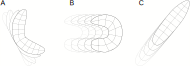
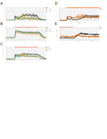

---
# Front matter
title: "Identification of neural premotor substrates affecting nocifensive behaviour in Drosophila larvae"
author: |
	| Alastair Garner 
	| Supervisor: Dr. Tomoko Ohyama
date: 19/03/2020
documentclass: article

# Bibliography
link-citations:  true
csl:
	- current-biology.csl
color-links: true
linkcolor: Blue

# Formatting
numbersections:
	- 1
secnumdepth:
	- 3
geometry: 
	- letterpaper
	- margin=1in
mainfont: 
	- "Palatino Linotype"
sansfont:
	- "Avenir LT Std"
fontsize:
	- 12pt
---

# Introduction

*Introduction and statement of the problem (1 page)*

Locomotion encompasses a diverse range of behaviours with distinct ethological relevance. These highly coordinated and rhythmic behaviours are both executed by and genetically hardcoded into the nervous system.

Neural circuitry must coordinate numerous aspects of any given behaviour, activating distinct motor cohorts in a stereotyped sequence, whilst integrating sensory feedback to modulate the performance of the behaviour. Understanding how the wiring of neural circuits underpins the generation of these coordinated motor patterns offers insight into general neural mechanisms for rhythmicity, patterning and action selection. This has motivated research, particularly in basal locomotor modes, into quadrapedal walking in the cat[@ref] and mouse[@ref] peristaltic crawling in *Drosophila* larva[@ref] as well as swimming in fish(references), leech[@ref], lamprey[@ref] and *C. elegans*[@ref].

While well adapted for these basal locomotor modes, the same collection of muscles are commonly wired to coordinate the performance of alternative rythmic behaviours. The nocifensive behavioural repertoire of *Drosophila* larva includes a corkscrew-like "rolling" behaviour[@Tracey2003], that demonstrates a distinct motor profile to that for peristaltic crawling[@Heckscher2012]. How functionally unique patterns of MN and muscle activation are encoded by premotor circuitry is an open question. Here we seek to identify novel premotor interneuron components for the performance for alternative locomotor modes, using nocifensive behaviour in *Drosophila* larva as our model.

***

# Background
*Background information - i.e. relevant literature leading up to your studies (5 pages)*

The review articles from Clark *et al*.[@Clark2018] and Kohsaka *et al*.[Kohsaka 2017] were particularly useful for formulating the following section.

## Studying neuroethology in *Drosophila* 

(Venken 2011 for reference)

Use of Drosophila as a model system for studying neuroethology originates with the classic mutagenesis screening conducted by Seymour Benzer and colleagues, where mutated flies were assayed for novel behavioural phenotypes and associated genes determined by genetic mapping[@Konopka1971]. This established the classic "Genes to Behaviour" dogma. The development of genetic tools to selectively express genes of interest in specific cell types (UAS-GAL4 system)[@Brand1993] allowed for increased accessibility of the system. This has reached a head with the development of the split-GAL4 system[@Luan2006], to refine expression of exogenous genes to smaller populations of cells. This was exploited by Pfeiffer and colleagues[@Pfeiffer2010] and expanded upon by Jenett et al.[@Jenett2012] and others[@Gohl2011,@Li2014], who initiated the creation of 1000's of split-GAL4 lines with expression patterns restricted to fly nervous system. 

Within neuroethology these tools allowed for the manipulation of neuronal activity, with the development of effector lines to inhibit[@Baines2001,@Paradis2001], silence[@Sweeney1995, @Kitamoto2001] and artificially activate[@Rosenzweig2005,@Rosenzweig2008] neuron populations of interest. More recently the advent of optogenetics, where light activatable ion channels are expressed in neurons of interest, has allowed even greater temporal precision in activating[@Boyden2005] and inhibiting[@Mohammad2017] neurons. With expansion of the catalogue of available constructs to include wavelength-shifted variants of channelrhodopsin[@Klapoetke2014] the utility of optogenetics only continues to increase.

*(To Do - mention calcium imaging)*

This combination of genetic accessibility and tools for manipulation has made *Drosophila* a popular model for studying neuroethology. While much effort focuses on the adult fly, a subset of fly research focuses on the larval *Drosophila* for their reduced behavioural repertoire and comparatively small number of neurons (ca. 10,000, versus 100,000 in the adult). Analytical tools have been adapted from *Caenorhabditis elegans* research[@Swierczek2011] to allow for the development of high-throughput behavioural assays in *Drosophila* larva[@Ohyama2013]. Robust methods for behavioural quantification have also been developed based on user-curated behavioural definitions[@Ohyama2013], unsupervised hierarchical clustering[@Vogelstein2014] and supervised machine learning techniques[@Kabra2013, @Jovanic2017]. 

*(To Do - Mention neuron tracing)*

## *Drosophila* larval nocifensive behaviour

*Drosophila* larva have emerged as a powerful model to study nociception and nocifensive behaviour over the last 20 years. In their natural environment *Drosophila* are preyed upon by parasitoid wasps [@Carton1986] like those of the *Chalcidoidea* and *Ichneumonoidea* superfamilies. The female wasp inserts its sharp ovipositior through the larval cuticle and lays an egg. The developing wasp larva then digests the host *Drosophila* from the inside out, eventually resulting in the pupation and eclosion of a juvenile wasp. Parasitoid wasps produce a strong selective pressure on *Drosophila*[@Powell1997], which has lead to the evolution of endogenous mechanisms to fight the parasite. The first of these is a cellular immune response that can destroy the wasp egg, preventing the development of wasp and thus also the death of the *Drosophila* larva[@Rizki1990]. The other is a unique behavioural repertoire in which the *Drosophila* larva produces a stereotyped pattern of nocifensive behaviours. These consist of an initial C-shape bend, where the head and tail are simultaneously moved either to the left or right of the body axis[@Ohyama2013], followed by a corkscrew-like "roll" motion where the larva rotates around the anteroposterior axis[@Tracey2003]. After first presentation these behaviours can repeat, but are typically concluded by a bout of "fast-crawl", where the animal crawls with an elevated frequency of peristalsis (@fig:repertoire). The direction of a roll is dictated by the position at which the wasp ovipositor is inserted, such that the rotation of the larval body removes the ovipositor, preventing egg-laying[@Hwang2007]. In laboratory conditions rolling behaviour can be readily elicited by activation of the *painless* expressing class IV dendrite arborization (CIVda or MDIV) neurons, a class of multimodal nociceptors that respond to harsh mechanical stimulation[@Zhong2010], noxious temperatures[@Zhong2012] and strong UV light[@Xiang2010].

*(To Do - replace cartoon with timelapse of image frames for each behaviour)*

{#fig:repertoire}

Subsequent efforts have begun to elucidate the neural substrates downstream of these nociceptors that facilitate the performance of larval nocifensive behaviour. Ohyama *et al*.[@Ohyama2015] produced a serial section electron microscopy (EM) volume for the brain of a first instar larva allowing them to trace all the downstream synaptic partners of the CIVda neurons. From this they were able to identify 13 distinct pairs of postsynaptic target neurons, based on morphology. In particular they identified a population of second order interneurons, termed Basin neurons, that received input from both the CIVda and the mechanosensory chordotonal (Ch) neurons. Imaging these neurons illustrated they were functionally multisensory and that activation of Ch neurons using a vibration stimulus affected a multimodal enhancement on rolling behaviour. Activation of Basin or the disynaptic downstream neuron pair, Goro, was sufficient to induce the full escape repertoire.

A09l neurons, coined 'Down-and-Back' (DnB) neurons[@Burgos2018], have also been linked to the Goro-mediated roll pathway. A09l neurons receive monosynaptic input from both CIVda and gentle-touch receptor neurons, CIIda and CIIIda, and when activated were sufficient to elicit rolling behaviour. Notably activation of A09l was more likely to result in C-shape bending without a resultant roll than with a roll. Further, silencing Goro reduced the probability of observing rolling behaviour without impacting the likelihood of C-shape bending, suggesting that these two locomotor modes may in fact be under control via separable, modular motor programmes[@Burgos2018]. Goro was found to be three synapses downstream of A09l, leading the authors to conclude that A09l-mediated rolling behaviour was Goro-dependent. The authors also note that A09l make direct synapses onto the lateral transverse 1 (LT1) motor neurons, which projects to muscle 21 of the somatic muscles. This muscle has been identified to be important for self-righting behaviour[@Picao-Osorio2015], where an upside-down larva must correct its dorsoventral orientation - a behaviour believed to require similar motor coordination to rolling behaviour.

Other neuron populations have also been associated with larval nocifensive behaviour. Hu *et al*.[@Hu2017] characterised two further sets of second-order sensory neurons downstream of CIVda and involved in nocifensive behaviour: A08n, which had previously been previously linked to rolling[@Vogelstein2014] and a dorsal pair of insulin-like peptide 7 producing neurons (DP-ilp7). A08n was shown to be both necessary and sufficient to elicit rolling behaviour, whereas the DP-ilp7 neurons triggered a bending behaviour akin to the initial C-shape bend performed prior to rolling. DP-ilp7 neurons also received innervation from the low-threshold mechanoreceptor neuron CIIda and CIIIda[@Grueber2002,@Tsubouchi2012] suggesting, like Basins, these neurons may be integrating sensory information to gate the performance of rolling. Interestingly they also noted that activation of the CIIda mechanoreceptor, in the absence of CIVda nociceptor activation, was sufficient to trigger rolling behaviour, compounding the evidence that rolling involves the convergence of different sensory modalities.

As of yet, few studies have been able to conclusively identify motor neurons that are involved in rolling behaviour. One insight comes from Yoshino *et al*.[@Yoshino2017] who identify the medial clusters of C4da second-order interneurons (mCSIs), sufficient to elicit rolling behaviour, which are functionally connected to the segmental nerve A (SNa) motor neurons. mCSIs too receive monosynaptic input from CIVda neurons, but are not functionally connected to Goro neurons[@Yoshino2017]. Activation of mCSIs induced calcium transients in the SNa motor neurons, but were not directly connected to one another. Silencing the SNa motor neurons gave no deficit in normal exploratory behaviour (crawling and turning), but did reduce the percentage of animals that performed a roll, suggesting that the downstream lateral transverse muscle (muscles 21, 22 & 23) play a key role in performing this behaviour. This result was concordant with the finding that the lateral transverse muscles are important in the related self-righting behaviour[@Picao-Osorio2015].

*(To Do - Update circuitry diagram)*

{#fig:circuitry}

## Musculature

[@Kohsaka2019]

The somatic musculature of Drosophila larva is highly stereotyped and necessary for the peristaltic waves that comprise the basal locomotor mode, forward crawling[@Heckscher2012]. Each abdominal hemisegment contains 30 muscles that can broadly be categorised by two groups: the longitudinal muscles which arrange in parallel with the body axis, or the transverse muscles which are circumferential to the body wall[@Bate1990]. Each of these 30 muscles are innervated by a single "big" bouton motor neuron (1b motor neurons), as well as a single "small" bouton (1s motor neuron) neuron that projects to each of the muscles within one of three functionally related groups (dorsal longitudinal, ventral longitudinal and transverse)[@Landgraf2006,@Peron2009]. These motor neurons provide glutamatergic, excitatory innervation of the muscles. Many 1b neurons show rhythmic activity coincident with waves of muscle contraction during both forward and backward locomotion[@Newman2017]. 

*(To Do - Diagram of somatic musculature)*

## Motor Coordination

Heckscher *et al*.[@Heckscher2012] characterised the motor profile of the somatic musculature, identifying that there was a specific intrasegmental order of muscle contraction. They found that during forward crawling the dorsal and ventral longitudinal muscles of a given segment would contract simultaneously, followed by contraction of the lateral transverse muscles. With both the head and tail anchored, this staggered muscle activation propagates from the posterior to anterior segments, moving the body forward.[@Heckscher2012].

The mechanism for encoding this phase delay is considered to be hardwired given an isolated larval CNS, lacking sensory feedback, shows fictive locomotor activity with a fixed phase delay during both forward and backward waves of activity[@Pulver2015]. To elucidate the neural substrate encoding this delay Zwart *et al*.[@Zwart2016] performed TEM reconstruction (as in Ohyama *et al*.[@Ohyama2015]) of the motor neurons innervating the LT1-4 and LO1 muscles, as well as the upstream premotor synaptic partners of these motor neurons. They identified a single inhibitory GABAergic premotor neuron (iIN-1), projecting exclusively to the lateral transverse MNs, which was capable of producing this phase delay. Silencing iIN-1 (A14a? - Zarin) resulted in a simultaneous contraction of the longitudinal and transverse muscles[@Zwart 2016]. Interesting excitatory premotor neurons innervating LT muscles (eIN-1,eIN-2 and eIN-1) and longitudinal muscles (aCC, aka MN1-Ib) are coactive during waves of activity, suggesting iIN-1 to be a core component implementing the L-T phase delay.

Aside from the coordinated sequencing of motor activation, appropriate termination of motor activity during wave propagation is also essential for effective behaviour. Potential mechanisms for this were proposed by Kohsaka *et al*.[@Kohsaka2014] on discovery of a population of approximately 10 pairs inhibitory glutamatergic premotor neurons, named Period-positive Median Segmental Interneurons (PMSIs). The PMSI neurons showed a similar pattern of rhythmic activity to motor neurons, but with a short time-delay. Genetic silencing of these neurons increased the duration of a single wave of motor neuron activity and reducing the speed of crawling, whereas activation inhibited all motor activity. The authors thus suggested the PMSIs are important for regulating the duration of motor neuron bursting and, by extension, regulating the speed of peristalsis[@Kohsaka2014].

*(To Do - Add paragraph for Kohsaka 2019)*

Most recently Zarin *et al*.[@Zarin2019a] (published after the work conducted for this thesis) undertook the mammoth effort of reconstructing all 60 MNs and 236 PMNs in a single TEM segment of the larval nervous system. With this they sought to answer how a common population of muscles could generate two distinct behavioural programs, that of forward and backward crawling. Using calcium imaging of patterns of pan-muscle activation they built a profile of motor activation during both a forward and backward wave, identifying differences in the order of muscle recruitment for either behavioural mode. The most prominent of these differences was seen in the Ventral Orbital (VO) muscles which are activated in the late phase of a forward crawl, but the earliest phase of a backward crawl.  This pointed to the idea that distinct premotor circuits were required to enact the behaviour-specific muscle recruitment order. PMN reconstruction did not elucidate specific neurons innervating functionally distinct muscle groups for either behaviour, suggesting combinatorial coding is required to recruit behaviour-specific, functional muscle groups. However, they developed a recurrent network model of PMN and MN neurons across two segments, constrained by the measured connectivity, and demonstrated that the patterns of connectivity in this motor network was sufficient to elicit comparable patterns of muscle contraction for both forward and backward peristalsis. The model was successfully validated on known PMN activity for A14a, A18j, A01c (iIN-1,eIN-1,eIN-2) [@Zwart2016] and A18a[@Hasegawa2016], as well as recordings from novel PMNs (A31k, A06l and A23a)[@Zarin2019a].

***

## Other papers

Grueber 2002 - first described C4da's

Left-Right coordination

Heckscher 2015 - left/right coordination
Hasegawa 2016 - CLI1, CLI2
Yoshikawa 2016 - LLNs

Hughes 2007 - 'Mission accomplished' idea
Fushiki 2016 - A27h
Takagi 2017 - Wave neuron - Forward vs Backward crawl
Jovanic 2016 - Lateral disinhibition
Kaneko 2017 - serotonergic modulation of MD IVs
Schneider-Mizell 2016
Gerhard 2017
Carreira-Rosario 2018

Kiehn O. Development and functional organization of spinal locomotor circuits - reference for "left- right alternating limbs or extensor-flexor muscles in vertebrate animals"

***

# Research Statement

*Rationale for the study, hypothesis and specific aims (1 page)*

## Rationale

(Work in Progress - one or two paragraphs)

## Aims and Hypothesis

***

**Aim 1:** To identify novel premotor interneurons population implicated in the performance of nocifensive behaviours in *Drosophila melanogaster* larva.

**Hypothesis 1:** Certain discrete populations of premotor interneurons are necessary for the performance of different components of the noficensive behaviour repertoire. Exogenous activation of these neuron populations will perturb noficensive behaviour across a breadth of quantifiable behavioural metrics. These include, but are not limited to, the likelihood of rolling, time-spent rolling and rolling amplitude, as well as postural metrics like crabspeed and body curvature.

***

**Aim 2:** Characterise phenotypic contribution of candidate neurons populations to nocifensive and basal locomotor behaviours.

**Hypothesis 2:** Premotor interneuons implicated in rolling behaviours will show the same phenotype independent of which higher-order neuron population is used to activate the nocifensive repertoire. Additionally these neurons may be important for the performance of non-nocifensive locomotor behaviour. If so, genetic activation or inhibition of these neurons might affect change in basal locomotor metrics (e.g. crawling speed and frequency).

***

**Aim 3:** Assess the phenotypic effect of premotor neurons with both complementary and contrasting motor cohort recruitment on nocifensive behaviour.

**Hypothesis 3:** Premotor populations that innervate similar motor neuron cohorts, with the same sign of neurotransmission  (excitatory/inhibitory), will affect similar components of the nocifensive behaviour repertoire. Perturbing the function of these neurons will manifest in a phenotypically similar manner. Premotor neuron populations that innervate different motor cohorts will have different effects on the performance of nocifensive behaviour. 

***

**Aim 4:** Evaluate the relative performance of different behaviour detection algorithms for quantifying rolling behaviour.

**Hypothesis 4:** Defining discrete behaviours (e.g. rolling) is subjective, so data processing pipelines of different design may report said behaviours differently. Thus depending on the algorithm used, the phenotypic differences observed with our candidate lines might manifest differently. Comparing the performance of these algorithms against a ground truth will elucidate the best pipeline for future analyses.

***

# Methodology
*Methods for each specific aim, including the rationale for the choice of methods when alternatives exist, possible problems that may be encountered and their solutions, analysis and interpretation of data, etc. (5 pages)*

## Fly Strains

**Stocks:**

| Stock                                                        | Owner |
| ------------------------------------------------------------ | ----: |
| *w;;attp2*                                                   |   T.O |
| *R72F11-GAL4(attp2)*                                         |   T.O |
| *R69F06-GAL4(attp2)*                                         |   T.O |
| *w;;UAS-CsChrimson*?                                         |   T.O |
| *UAS-CsChrimson(attp18);;R72F11-GAL4*                        |   T.O |
| *UAS-CsChrimson(attp18);;R69F06-GAL4*                        |   T.O |
| *UAS-Chrimson::Venus(attp18) (V)*                            |   T.O |
| *72F11-LexA(Jk22),UAS-impTNT-E;13xLexAop-CsChrimson-tdTomato(vk5)* |   T.O |
| *72F11-LexA(Jk22),UAS-cTNT-E;13xLexAop-CsChrimson-tdTomato(vk5)* |   T.O |
| *72F11-LexA p65(Jk22);13xLexAop-CsChrimson-tdTomato(vk5),UAS-EGFP-Kir2.1* |   T.O |
| *w+;UAS-TNTe*                                                |   T.O |
| *w;;UAS-Kir2.1-GFP (V)*                                      |   T.O |

## Behavioural apparatus

A custom rig was employed for conducting behavioural experiments, of similar design to that in previous publications[@Ohyama2013, @Ohyama2015]. Infrared illumination of the stage is recorded by a top-mounted camera and LED under-lighting (624/630nm) were used for optogenetic stimulation. Recordings were controlled through the Multi-worm Tracker (MWT) software [http://sourceforge.net/projects/mwt](http://sourceforge.net/projects/mwt) [@Swierczek2011] whilst control of the hardware module was controlled through the Stimulus Control Module (SCM) software. Objects detected in MWT are saved as contours from which simple features can be extracted (crabspeed, curve, midline) using the LARA software package [https://sourceforge.net/projects/salam-hhmi/](https://sourceforge.net/projects/salam-hhmi/). All subsequent analysis, statistics and generation of figures were performed using MATLAB.

## Behavioural Experiments

Embryos were collected for 24 hours at 25&deg;C and ??% humidity. Foraging third instar larvae were used for all experiments. Larvae were raised in the dark at 25&deg;C for 3-4 days on fly food containing *trans*-retinal (Sigma, R2500) at a concentration of ?500? M (0.2mM?).

Before the experiments the larvae were separated from food by suspension in 15% sucrose and with water. Larvae were dried then transferred to the centre of a 25x25 cm transparent plastic, square plate covered in a layer of 2% agar gel. Up to 80 larva were transferred to the plate for any given recording. The behavioural room was kept at ??&deg;C and ??% humidity. When using strains containing *UAS-CsChrimson* larval collection and experiments were run in darkness. 

## Behavioural Analysis
### Choreography

Behavioural recordings were captured with the Multi-worm Tracker (MWT) software [http://sourceforge.net/projects/mwt](http://sourceforge.net/projects/mwt) [@Swierczek2011]. Raw videos were never saved, due to their large file size. Instead MWT outputs text files with the spine and contour for each object tracked at a refresh rate of approximately 30fps. Objects that were tracked for fewer than 5 seconds, or travelled less than one body length in distance were rejected. From this tracking data we were able to compute key parameters of larval motion using the Choreography program (packaged with MWT)[@Swierczek2011], including generating the spine of the object, curve, speed and crabspeed.

### LARA/Salam/Feature Extraction

To detect the performance of discrete rolling and crawling events we used the LARA software package [https://sourceforge.net/projects/salam-hhmi/](https://sourceforge.net/projects/salam-hhmi/) [@Ohyama2013]. LARA takes, as its input, variables generated by Choreography (described above), using crabspeed for detection of rolling and speed for determining bouts of peristaltic crawling. In brief, detection of a rolling event is determined by the crabspeed value passing a set upper threshold (2.8mm/s) and persists until it drops below a lower threshold (1.8mm/s). Events are combined if they occur within 1 second of one another. A crawling run is defined as a minimum of three consecutive peaks in the speed variable, all of which must exceed a fixed threshold of 0.6mm/s, as well as exceeding 3/10 of the mean peak amplitude computed across the full duration the animal was tracked. A crawling run was broken if the gap between two consecutive good peaks was greater than 2s, or if other behaviours were detected. 

### JAABA

An alternative roll classifier was trained using the Janelia Automatic Animal Behavior Annotator (JAABA)[@Kabra2013]. Outline and spine files, generated with Choreography, are input to into JAABA, which are displayed in the GUI. Manual labelling of rolling events allows for supervised training of a behaviour classifier. Training is iterative, allowing the user to score the predicitons made by JAABA, affirming correct prediction and overruling false positives before retraining. The finalised classifier can be applied to other experiments to score behaviour.

Using spine and outline data JAABA computes a suite of 'per-frame' features describing the locomotion, landmarks and appearance of the animal. On top of this, JAABA computes a collection of 'window' features that describe the distribution of per-frame features around the current frame, adding temporal context. The combination of per-frame and window features are then implemented in a 'Gentle Adaboost' learning algorithm [@Friedman2000].

*(To Do - add Shua's criteria for scoring rolling)*

### JBM

A final pipeline[@Jovanic2017], here referred to as the 'JBM', was used to quantify rolling behaviour. Similarly JBM takes, as its input, contour and spine files generated by Choreography. A collection of different features are generated from this describing the locomotion, posture and landmarks of the larvae, which are used to train the classifier. The architecture used to build this supervised learning algorithm consists of an initial Random Forest classifier, a layer to eliminate inconsistencies and a final Random Forest classification layer. This architecture was used to train classification of 6 behaviours[@Jovanic2017] including crawling and rolling.

## Statistical Analysis

Statistical analyses were performed using MATLAB (MathWorks) software. For our initial screen, the proportions of animals that performed a behaviour (roll) were compared between genotypes using the Fisher's Exact test. Comparison of other metrics were conducted using the Kruskall-Wallis test. Where multiple comparisons were made, *p* values were corrected using the Bonferroni correction.

## Immunohistochemistry

The following primary antibodies were used: chicken anti-GFP (1:25, supplier) and rabbit anti-dsRed (1:25, supplier). For secondary antibodies we used Alexa Fluor 488 goat anti-chicken (1:250, supplier) and Alexa Fluor 568 goat anto-rabbit (1:250, supplier).

The protocols used are identical to those listed on the FlyLight website ([https://www.janelia.org/project-team/flylight/protocols](https://www.janelia.org/project-team/flylight/protocols)). The CNS of third instar larvae were dissected in cold 4% phosphate-buffered saline (PBS) then transferred to 4% paraformaldehyde (PFA, supplier) on ice until starting a timed fixation. Samples were fixed in fresh 4% PFA at room tempereature for 1 hour then underwent four 15 minute washes in 1% Triton X-100 (PBT) in PBS. Samples were preblocked with 4% normal goat serum (NGS) for 2 hours at room temperature. Samples were then incubated with primary antibodies in 1% PBT for 4 hours at room temperature, then transferred to 4&deg;C for 2 nights. Following four 15 minute washes in 1% PBT, the samples were incubated with secondary antibodies in 1% PBT for 4 hours at room temperature, then continued incubation at 4&deg;C for two overnights. The samples were washed a final four times for 15 minutes in 1% PBT before being mounted in Vectashield mounting medium (supplier). Images were taken with a *Zeiss* Axio Imager fluorescence microscope.

***

# Results

## Identification of novel interneuron populations affecting nocifensive behaviour

To determine possible candidates for neurons involved in nocifensive rolling behaviour we designed an optogenetic behavioural screen to assess the functional relevance of random neuron populations in rolling behaviour. We utilised the catalogue of split-GAL4 lines maintained by the Fly Light database [@Pfeiffer2010,@Jenett2012,@Li2014] to identify 135 driver lines with expression patterns in the ventral nerve cord (VNC). To test their functional relevance we performed optogenetic coactivation of these neuron populations with Basin neurons [@Ohyama2015] providing two 15 second bouts of red light, with a 30 second interval between bouts. We anticipated that, should a neuron population be part of the nocifensive circuitry, that we might see changes to the likelihood, amplitude and duration of rolling. 

We compared the performance of rolling of the 135 different split-GAL4 lines to a positive control (*attp2,72F11-GAL4,UAS-CsChrimson*) and evaluated the performance of rolling based on the metrics generated by the Salam pipeline for scoring behaviour[@Ohyama2013]. For each split-GAL4 line (which we will refer to by the last four digits in their name) tested we achieved 50 < n < 250 animals across an average of 4 repeats over multiple days. For statistical analysis experiments were only compared to those controls performed on the same-day to account for day-to-day variance. **Some figures are normalised** by control values, such that the resultant metric is the **difference ($\Delta$) between the experimental and same-day control**.

At an initial light intensity of ???W/cm2 stimulation reliably induced rolling in 90% of control animals per-trial. If the neuron populations being tested were important or necessary for rolling behaviour, we expected that we might see a decrease in the incidence of rolling. Only one line tested gave a significant decrease in the proportion of animals that performed rolling behaviour (4169, [@fig:screen_control]A), when compared to the same-day control. Interestingly, despite the high baseline of roll proportion in controls we did observe several lines that showed an increase in roll proportion. We note that other lines that increase roll proportion may have been occluded, given said high baseline.

{#fig:screen_control}

To assess the day-to-day variability in data we analysed the performance of control animals across each trial. It is understood that the likelihood of rolling varies with larval age and, by extension, larval size (supplemental). As such we restricted experiments to third instar larva and ignored animals with an average area < 2.5mm2 in post-hoc analyses, below which roll likelihood decreases. Despite this, we saw a range of larval size across our control experiments, with median values from 2.5 to 5mm2 ([@fig:screen_control]C). Likewise we observed a large degree of variation in the the per-animal time-spent-rolling ([@fig:screen_control]E) and number of rolls between trials ([@fig:screen_control]D). Such variation may confound statistical analyses versus our experimental lines. 

To assess changes in the presentation of rolling behaviour we analysed the average time spent rolling by individual. We observed that 65 of the lines tested showed a significant increase in the time spent rolling, while 6 showed a significant decrease ([@fig:supp_1]A). Further we found many lines showed statistically significant increases and decreases in the number of rolls per animal ([@fig:supp_1]B) and the average amplitude of rolls per animal ([@fig:supp_1]C), where the amplitude of a roll is defined as the maximum crabspeed during a bout of rolling. The abundance of significant results should be viewed cautiously, as having values of *50 < n < 250* will increase statistical power.

Whilst we observed changes in the number, duration and amplitude of roll bouts understanding how these changes manifest in the posture and movement of the larva requires analysis of lower-level metrics. Rolling behaviour is characterised predominantly by high curvature along the "spine" (midline from head to tail) coincident with elevated crabspeed (movement perpendicular to the body axis). Given that roll bouts are scored determinant on crabspeed (see Methods) it is unsurprising that most of the lines presenting increased roll duration also show increased average crabspeed during stimulation ([@fig:screen_groups12]A). Notably the average curvature of the animals does not copresent with increased rolling, as 1816 and 1817 showed significantly decreased curvature (p < 0.005) during the bout of stimulation ([@fig:screen_groups12]B).

{#fig:screen_groups12}

Given the plethora of significant results and the relative variability of our control data it was important to assess changes to rolling at a finer timescale, as well as on an individual basis, before selecting lines to study further. We ignored all lines where either the experimental larva or same-day controls had *n < 50* and sought to eliminate other lines based on uncharacteristic control data.

To do this we visualised the previously mentioned metrics over the time series of the experiment. Lines presenting with increased roll proportions generally fell into two categories. The first presented with a delayed but increased peak in roll percentage 2 seconds after the onset of stimulation ([@fig:screen_groups12]C). Roll percentage steadily decreased, yet remained higher than the control, throughout the remainder of stimulation. While 1816 showed a significant increase in crabspeed during stimulation (p < 0.005) the temporal profile of crabspeed showed only a marginal increase, limited to the first 5 seconds of stimulation ([@fig:screen_groups12]D). Otherwise 1816 and 1817 were indistinguishable from the control. However, both 1816 and 1817 did demonstrate a marked decrease in curve during stimulation ([@fig:screen_groups12]E).

The second group (0666,1750, 4052, 4232) showed a strong biphasic response with an initial spike in roll percentage within 1 second of stimulation, followed by a delayed and prolonged increase in roll percentage after ~5 seconds ([@fig:screen_groups12]F). For 0666, 4052 and 4232 this was copresented with and marked increase in crabspeed during the stimulation bout ([@fig:screen_groups12]G). All lines showed a temporal profile in curve similar to that of the control ([@fig:screen_groups12]H).

Another group of lines (1951, 4245, 4189) presented a decrease in roll percentage during the late phase of the stimulation bout ([@fig:screen_groups34]A). This was complemented by a decrease in both the curve and the crabspeed of the larvae throughout the course of stimulation ([@fig:screen_groups34]B&C). We noted that the control data was higher than usual for these particular comparisons, perhaps distorting the significance of these results. As such we did not follow up on these particular lines.

The final line of interest, 4248, displayed no obvious phenotype for rolling behaviour ([@fig:screen_groups34]D), but failed to display the stereotyped 'fast-crawl' behaviour that follows a bout of rolling. Analysis of larval speed in control data shows that, at the end of a bout of stimulation, speed increases above the pre-stimulation baseline ([@fig:screen_groups34]E) *(regenerate this plot to show baseline before stim)*. Larval speed in 4248 only increased to that of baseline.

{#fig:screen_groups34}

Our data suggested that we might have found candidate lines that are implicated in the performance of larval nocifensive behaviour. To test the robustness of these responses we choose to repeat the experiment at a reduced light intensity (???W/cm2). Basin-activated nocifensive behaviours present differently at different stimulation intensity. At high intensities rolling behaviours are sustained throughout a period of stimulation, whereas at lower intensities larval switch to crawling behaviours after 5-10s (supplemental). Therefore we wanted to know whether the observed phenotypic effects were consistent, or unique to the high-power activation. 

Consistent with our original screen 1816 and 1817 showed an increase in the total time-spent rolling ([@fig:screen_LED05]B,E). While 1816 also had a significant decrease in the average curve during stimulation ([@fig:screen_LED05]C), neither 1816 or 1817 appeared markedly different over the time series of stimulation ([@fig:screen_LED05]F). 1750 and 4232 also showed consist results with the original screen, demonstrating an increase in roll duration and crabspeed across the bout of stimulation ([@fig:screen_LED05]G,H). In contrast to the initial screen 4052 and 0666 did not present an increase in either roll percentage or crabspeed ([@fig:screen_LED05]I,J). Again we note that there is a large variation in the performance of control data, most evidently between the controls run with 4232 and 1750 versus 0666 and 4052, with an 8-fold increase in the maximum roll percentage ([@fig:screen_LED05]G,I) and 2-fold increase in average crabspeed ([@fig:screen_LED05]H,J). Further repeats will be necessary to determine the validity of these results.

{#fig:screen_LED05}

***

# Conclusion

*Short conclusion and statement of expected contributions to original knowledge (1 page)*

*(To Do - one or two short paragraphs)*

***

# Bibliography

\singlespacing

\doublespacing

***

# Supplemental

{#fig:supp_1}