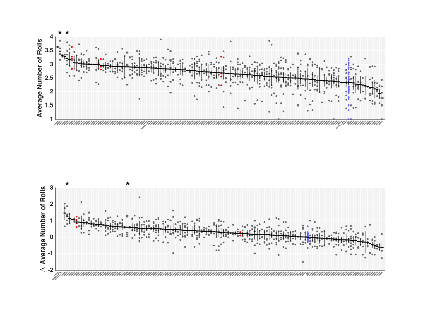
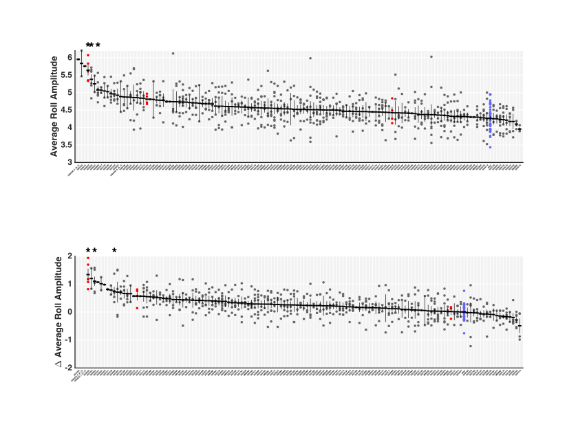
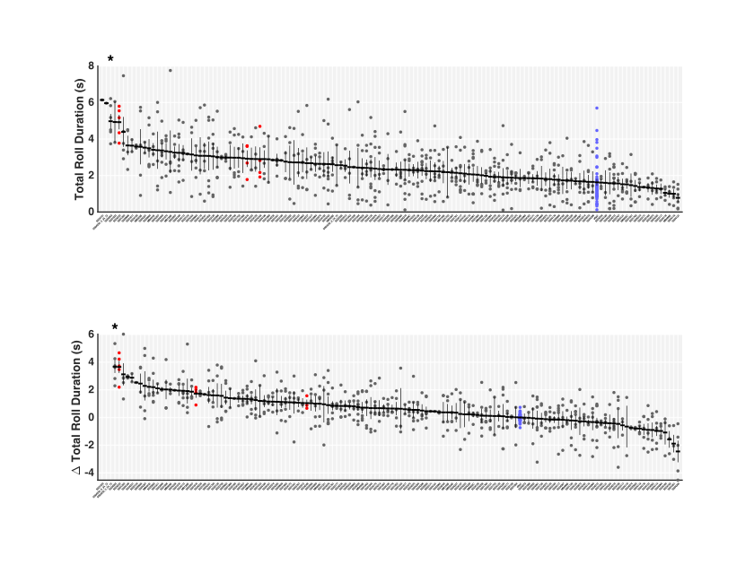
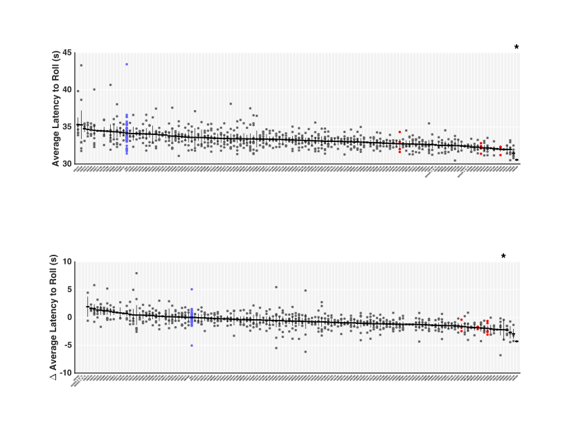
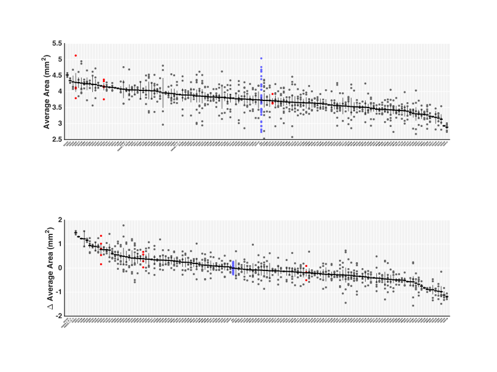
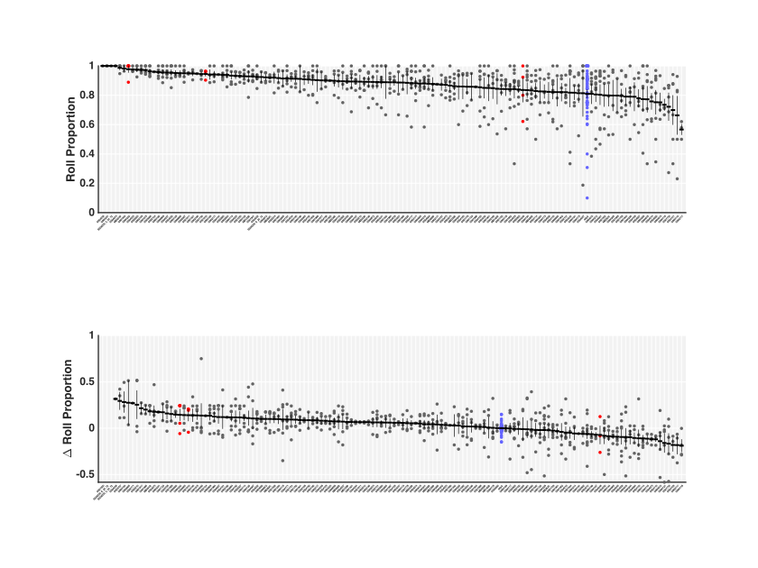

# Screen Results

Below are the results from the original screen - summer 2017.

All p values are calculated using Wilcoxon-Mann-Whitney ranked sum test with the Bonferroni correction.

Lower figures are generated by subtracting the control value from the experimental values for each day containing experiments. Hence, the range for experimental data is small and centred around 0. This allows for observing the relative number of rolls (example) for a given genotype versus the control of the same day, to remove day-to-day variation (observed in upper figure)

## Interesting Genotypes

SS04050

SS04052

SS04232

SS01075

## Number of rolls

SS01075 - sig higher

SS04050

## Roll amplitude

SS04232

SS04052

SS04050

## Average roll duration

SS04052

## Total roll duration

SS04052

## Average latency to (first) roll

 

SS04050

## Average Area

## Roll proportion

