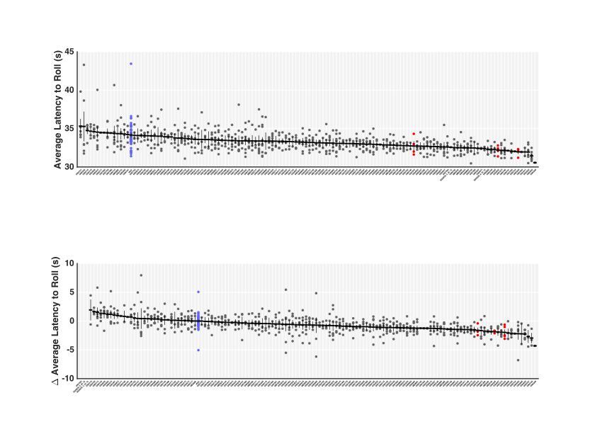

# Introduction

*Introduction and statement of the problem (1 page)*


Main text of thesis

This is some more text


# Background
*Background information - i.e. relevant literature leading up to your studies (5 pages)*

### Checklist
- Escape behaviour overview
	- bit of history (Marder & the leech)
	- discovery of rolling
	- neural substrates of rolling
- Ohyama 2015
- Other roll neurons
	- Down and Back,  etc
- Motor sequencing
	- Reflex arc/ agonistic/antagonistic muscles
	- Central Pattern generators
	- Larval crawling
- 


## Nociception

[@Grueber2002],[@Hwang2007], [Ohyama2015], [@Tracey2003], [@Jovanic2016], [@Xiang2010], [@Carton1986]


## Quantifying Escape Behaviours

[@Vogelstein2014], [@Ohyama2013], [@BransonXXXX]


## Musculature/Coordination

[@HeckscherXXXX]

# Rationale

*Rationale for the study, hypothesis and specific aims (1 page)*


# Methodology
## Methods More

*Methods for each specific aim, including the rationale for the choice of methods when alternatives exist, possible problems that may be encountered and their solutions, analysis and interpretation of data, etc. (5 pages)*

### To Do 
- type of camera
- section on

## Fly Strains

**Stocks:**
*w;;attp2*
*R72F11-GAL4* 
*R69F06-GAL4*
*UAS-CsChrimson*
*R72F11-GAL4,UAS-CsChrimson*
*R69F06-GAL4,UAS-CsChrimson*

## Behavioural apparatus

A custom rig was employed for conducting behavioural experiments, of similar design to that in previous publications[@Ohyama2013, @Ohyama2015]. Infrared illumination if the stage is recorded by a top-mounted camera and LED under-lighting (624/630nm) were used for optogenetic stimulation. Recordings were controlled through the Multi-worm Tracker (MWT) software [http://sourceforge.net/projects/mwt](http://sourceforge.net/projects/mwt) [@Swierczek2011] whilst control of the hardware module was controlled through the Stimulus Control Module (SCM) software. Objects detected in MWT are saved as contours from which simple features can be extracted (crabspeed, curve, midline) using the LARA software package [https://sourceforge.net/projects/salam-hhmi/](https://sourceforge.net/projects/salam-hhmi/). All subsequent analysis, statistics and generation of figures were performed using MATLAB.

## Behavioural Experiments

Embryos were collected for 24 hours at 25&deg;C and ??% humidity. Foraging third instar larvae were used for all experiments. Larvae were raised in the dark at 25&deg;C for 3-4 days on fly food containing *trans*-retinal (Sigma, R2500) at a concentration of ?500? M.

Before the experiments the larvae were separated from food by suspension in 15% Sucrose and with water. Larvae were dried then transferred to the center of a ?30x30? cm transparent plastic, square plate covered in a layer of 2% agar gel. Up to 80 larva were transferred to the plate for any given recording. The behavioural room was kept at ??&deg;C and ??% humidity. When using strains containing *UAS-CsChrimson* larval collection and experiments were run in darkness. 

## Behavioural Analysis
### Choreography

Behavioural recordings were captured with the Multi-worm Tracker (MWT) software [http://sourceforge.net/projects/mwt](http://sourceforge.net/projects/mwt) [@Swierczek2011]. Raw videos were never saved, due to their large file size. Instead MWT outputs text files with the spine and contour for each object tracked at a refresh rate of approximately 30fps. Objects that were tracked for fewer than 5 seconds, or travelled less than one body length in distance were rejected. From this tracking data we were able to compute key parameters of larval motion using the Choreography program (packaged with MWT)[@Swierczek2011]. More text here 

### Salam/Feature Extraction

I could insert an image here...


# Results


## Aim 1

To determine possible candidates for neurons involved in nocifensive rolling behaviour we designed an optogenetic behavioural screen to assess the functional relevance of random neuron populations in rolling behaviour. We utilised the catalogue of split-GAL4 lines maintained by the Fly Light database [@Pfeiffer2010,@Jenett2012,@Li2014] to identify 134 driver lines with expression patterns in the ventral nerve cord (VNC). To test their functional relevance we performed optogenetic coactivation of these neuron populations with Basin neurons [@Ohyama2015], using a *72F11-GAL4,UAS-CsChrimson*. We ancipitated that, should a neuron population be part of the nocifensive circuitry, that we might see changes to the latency, amplitude and duration of rolling. 





# Summary
*Summary of results to date (specific items may be included in methods, if preferable)*


# Conclusion

*Short conclusion and statement of expected contributions to original knowledge (1 page)*


# Convert to presentation

```
pandoc -t revealjs -s myslides.md -o myslides.html -V revealjs-url=https://revealjs.com -V theme=serif --slide-level=2
```
