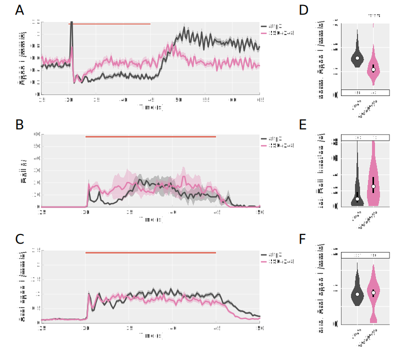

---
# Front matter
title:  "Identification of neural premotor substrates affecting nocifensive behaviour in Drosophila larvae"
author: Alastair Garner 
date: April 2020
documentclass: article

# Bibliography
link-citations:  true
csl:
	- current-biology.csl
color-links: true
linkcolor: Blue

# Formatting
numbersections:
	- 1
secnumdepth:
	- 3
geometry: 
	- letterpaper
	- margin=1in
mainfont: 
	- "Palatino Linotype"
sansfont:
	- "Avenir LT Std"
fontsize:
	- 12pt
---

# Abstract {-}

Insert abstract here


# Résumé{-}

Insérez le résumé ici


# Acknowledgements {-}

Insert acknowledgements here


# Author Contributions {-}

Alastair Garner^a\*^ and Dr. Tomoko Ohyama^b\*^ conceived the project and maintained fly stocks. Alastair Garner performed and analysed all behavioural and imaging experiments. Jiayi Zhu^a^ generated some fly stocks and also offered invaluable discussion. Yassine Rahmouni^a^ and Dr Jean-Baptiste Masson^c,d^ assisted in setting up behavioural pipelines in the lab. Novel behavioural classifiers were trained by Shua Noh^b^. Some fly stocks were generously donated by Dr James W Truman^d^.

The material of this thesis, including text and figures, were written and produced by Alastair Garner and edited by Dr Tomoko Ohyama.

\*[alastairgarner@outlook.com](alastairgarner@outlook.com), [tomoko.ohyama@mcgill.ca](tomoko.ohyama@mcgill.ca)


\vfill


^a^Integrated Program in Neuroscience, McGill University, Montréal, Canada

^b^Department of Biology, McGill University, Montréal, Canada

^c^Decision and Bayesian Computation, Neuroscience Department, Institut Pasteur & CNRS, Paris, France

^d^Howard Hughes Medical Institute Janelia Research Campus, Ashburn, VA, USA


# Introduction

Neural circuitry must coordinate numerous aspects of a given behaviour, activating distinct motor cohorts in a stereotyped sequence, whilst integrating sensory feedback to modulate the performance of the behaviour. Understanding how the innate wiring of neural circuits underpins the generation of these coordinated motor patterns offers insight into general neural mechanisms for rhythmicity, patterning and action selection. This has motivated research, particularly in basal locomotor modes, into quadrapedal walking in the cat[@Kiehn2006a,@Nishimaru2009,@Buford1990] and mouse[@Crone2008e,@Grillner2009b,@Zagoraiou2009,@Dougherty2013,@Goetz2015,@Bikoff2016], swimming in fish[@Kimura2013a,@Song2016], leech[@Friesen2007] and lamprey[@Grillner2003,@Mullins2011], as well as crawling in *Drosophila* larvae[@Heckscher2012,@Clark2018a,@Kohsaka2017] and *C. elegans*[@Wen2012a,@Piggott2011,@Zhen2015].

*Drosophila* larvae are an excellent model system for studying locomotion given their genetic tractability, readily quantifiable behaviour[@Ohyama2013,@Kabra2013] and fully described somatic musculature[@Bate1990]. Each hemisegment of the ventral nerve cord (VNC, analogous to the vertebrate spinal cord) contains 250 interneurons[@Rickert2011] which are hardwired to coordinated different behavioural modes. Of these, the nocifensive behavioural repertoire of a *Drosophila* larva includes a corkscrew-like "rolling" behaviour[@Tracey2003] that demonstrates a distinct motor profile to that for peristaltic crawling[@Heckscher2012]. How distinct circuits are wired to coordinate mutually exclusive locomotor patterns through a common musculature remains an unanswered question.

Here we seek to identify novel premotor interneuron components for the performance for nocifensive behaviour in *Drosophila* larvae. We will characterise the phenotypic contribution of these neurons to both escape behaviours and basal locomotion, to address whether premotor neurons exhibit behaviour specificity or promiscuity. Finally we will assay premotor neurons with similar anatomical connectivity to determine whether perturbation of common motor cohorts results in comparable phenotypes.


# Background
The review articles from Clark *et al*.[@Clark2018a] and Kohsaka *et al*.[@Kohsaka2017] were particularly useful for formulating the following section.


## *Drosophila* as a model system in neuroethology 

Use of *Drosophila* as a model system for studying neuroethology originates with the mutagenesis screenings conducted by Seymour Benzer and colleagues, where mutated flies were assayed for novel behavioural phenotypes and associated genes determined by genetic mapping[@Konopka1971]. This established the classic "Genes to Behaviour" dogma. The development of genetic tools to selectively express genes of interest in specific cell types (UAS-GAL4 system)[@Brand1993] allowed for increased accessibility of the system. This reached a head with the development of the split-GAL4 system[@Luan2006] which allowed restricted expression of exogenous genes to smaller populations of cells. This was exploited by Pfeiffer and colleagues[@Pfeiffer2010] and expanded upon by Jenett *et al*.[@Jenett2012] and others[@Gohl2011,@Li2014] who, collectively, have generated 1000's of split-GAL4 lines with expression patterns restricted to fly nervous system. 


Within neuroethology these tools allowed for the manipulation of neuronal activity, with the development of effector lines to inhibit[@Baines2001,@Paradis2001], silence[@Sweeney1995, @Kitamoto2001] and artificially activate[@Rosenzweig2005,@Rosenzweig2008] neuronal populations of interest. More recently the advent of optogenetics, where light activatable ion channels are expressed in neurons of interest, has allowed even greater temporal precision in activating[@Boyden2005] and inhibiting[@Mohammad2017] neurons. With expansion of the catalogue of available constructs to include wavelength-shifted variants of channelrhodopsin[@Klapoetke2014] the utility of optogenetics continues to be optimised.


In addition, genetically encoded calcium indicators (GECIs) have been developed to allow imaging of neuronal activity. These constructs, when expressed in a neuron population of interest, allow for visualisation of increases in internal calcium concentration - a proxy for bouts of neuronal activity. In particular *UAS-GCaMP*[@Wang2003], a split flourophore reconstituted by calcium binding, has become widely popular. This construct has since been iterated upon[@Chen2013a,@Dana2019], improving the temporal dynamics, sensitivity and signal-to-noise, allowing for single or population level neural recording with high temporal fidelity.


While much effort focuses on the adult fly, research on larval *Drosophila* has gained popularity for their reduced behavioural repertoire and comparatively small number of neurons (ca. 10,000, versus 100,000 in the adult). On top of this, larvae have a translucent cuticle, simplifying the application of optogenetics and imaging of neuronal activity. Analytical tools have been adapted from *Caenorhabditis elegans* research[@Swierczek2011] to allow for the development of high-throughput behavioural assays in *Drosophila* larvae[@Ohyama2013]. Likewise robust methods for behavioural quantification have also been developed based on user-curated behavioural definitions[@Ohyama2013], unsupervised hierarchical clustering[@Vogelstein2014] and supervised machine learning techniques[@Kabra2013,@Jovanic2017,@Masson2020]. 


## *Drosophila* larval nocifensive behaviour

In their natural environment *Drosophila* are preyed upon by parasitoid wasps [@Carton1986] like those of the *Chalcidoidea* and *Ichneumonoidea* superfamilies. The female wasp inserts its sharp ovipositior through the larval cuticle and lays an egg. The developing wasp larva then digests the host *Drosophila* from the inside out, eventually resulting in the pupation and eclosion of a juvenile wasp. Parasitoid wasps produce a strong selective pressure on *Drosophila*[@Powell1997], which has lead to the evolution of endogenous mechanisms to fight the parasite. The first of these is a cellular immune response that can destroy the wasp egg, preventing the development of wasp and thus also the death of the *Drosophila* larva[@Rizki1990]. The other is a unique behavioural repertoire in which the *Drosophila* larva produces a stereotyped pattern of nocifensive behaviours. These consist of an initial C-shape bend, where the head and tail are simultaneously moved either to the left or right of the body axis[@Ohyama2013] ([@fig:repertoire]A), followed by a corkscrew-like "roll" motion where the larva rotates around the anteroposterior axis[@Tracey2003] ([@fig:repertoire]B). After first presentation these behaviours can repeat, but are typically concluded by a bout of "fast-crawling", where the animal crawls with an elevated frequency of peristalsis ([@fig:repertoire]C). The direction of a roll is dictated by the position at which the wasp ovipositor is inserted, such that the rotation of the larval body removes the ovipositor, preventing egg-laying[@Hwang2007]. 

In laboratory conditions rolling behaviour can be readily elicited by activation of the class IV dendrite arborization (CIVda or MDIV) neurons[@Grueber2002,@Tracey2003], a class of nociceptors that respond to harsh mechanical stimulation[@Zhong2010], noxious temperatures[@Zhong2012] and strong UV light[@Xiang2010].


{#fig:repertoire}


## Sensory circuitry for escape behaviour

The class IV dendrite arborization (CIVda or MDIV) neurons are the primary nociceptive neurons in larvae and they tile the larval body wall[@Grueber2002,@Tracey2003]. Tracey *et al.* first implicated these neurons in nociception by identification of mutants for the gene *painless* (expressed in CIVda neurons) that fail to demonstrate nocifensive behaviour in response to thermal or mechanical nociceptive stimuli[@Tracey2003]. The same group later showed CIVda neurons to be both necessary and sufficient for triggering rolling behaviour, using a complement of neuronal activation and inhibition.

A number of papers have begun to elucidate the second-order sensory neurons, downstream of CIVda neurons, that are also implicated in escape behaviours. One of the keys to these findings was the generation of a serial section transmission electron microscopy (ssTEM) volume for the brain of a first instar larva[@Ohyama2015]. This dataset has allowed for reconstruction of individual neurons, as well as mapping the number of synaptic connections between pairs of neurons. In total 14 distinct pairs of neurons have been identified as receiving monosynaptic connections from the CIVda nociceptive neurons[@Gerhard2017]. At present, 8 pairs of these neurons have been shown to elicit escape behaviour when activated, including the Basin(A09a,c)[@Ohyama2015], DnB (A09l)[@Burgos2018], mCSI (A02m/n)[@Yoshino2017], Wave (A02o)[@Takagi2017], A08n and SeIN138[@Hu2017].

The majority of these escape-sufficient neurons make local projections within the ventral nerve cord (VNC). Of these, Ohyama *et al.*[@Ohyama2015] identified 4 pairs of segmentally repeated neurons, termed Basin neurons, which received input from both CIVda and vibration-detecting chordotonal (Ch) neurons. Imaging these neurons illustrated they were functionally multisensory and that activation of Ch neurons using a vibration stimulus affected a multimodal enhancement on rolling behaviour. Additionally they identified a single neuron pair, termed Goro, that received convergent pathways from Basin neurons, which was also sufficient to elicit rolling behaviour.

Another key target of CIVda neurons are the pair of A09l neurons[@Burgos2018], coined 'Down-and-Back' (DnB) neurons, which have also been linked to the Goro-mediated roll pathway. Like Basin neurons, A09l neurons are multisensory, receiving monosynaptic input from both CIVda and gentle-touch receptor neurons, CIIda and CIIIda, as well as sufficient to trigger escape behaviours.

Interestingly, the neurons discovered thus far are differentially implicated in specific elements of the escape repertoire. For instance, activation of Goro triggers C-bending and rolling, but not fast-crawling behaviour[@Ohyama2015]. There is also evidence that C-bending and rolling may be separable, given that the combination of A09l activation and Goro silencing reduces presentation of rolling, but not C-bending[@Burgos2018]. Similarly SeIN138 neurons, termed dorsal pair of insulin-like peptide 7 producing neurons (DP-ilp7), specifically trigger bending behaviour akin to the initial C-shape bend performed prior to rolling.

It is yet unclear to what extent each of these neurons is important for specific modes within the behavioural repertoire


{#fig:circuitry}

## Larval musculature

The somatic musculature of *Drosophila* larvae is highly stereotyped and well described[@Bate1990]. Each abdominal hemisegment contains 30 muscles that can broadly be categorised by two groups: the longitudinal muscles which arrange in parallel with the body axis, or the transverse muscles which are circumferential to the body wall[@Bate1990,@Clark2018a] ([@fig:muscles]). Each of these 30 muscles are innervated by a single "big" bouton motor neuron (1b motor neurons), as well as a single "small" bouton (1s motor neuron) neuron that projects to each of the muscles within one of three anatomically related groups (dorsal longitudinal, ventral longitudinal and transverse)[@Landgraf2006,@Peron2009]. These motor neurons provide glutamatergic, excitatory innervation of the muscles. The 1b neurons show rhythmic activity coincident with waves of muscle contraction during both forward and backward locomotion[@Newman2017]. 

![**Larval musculature and motor neurons.** Lateral schematic of the somatic musculature of a single abdominal hemisegment. The muscles are arranged as per the cartoon larva (bottom-right), with the head to the left. The ventral nerve cord (VNC) is coloured dark grey. Each of the somatic muscles is innervated by a single big bouton (Ib) type motor neuron of same name. Common motor neuron pseudonyms are listed apposed to the numerical labels. Muscles are grouped anatomically by their position on the dorsolateral axis and their orientation.](./Thesis_musculature.svg){#fig:muscles}


## Motor cohorts vary by behaviour

The anatomical grouping of muscles also allude to potential functional grouping. In fact, functionally co-active cohorts of muscles have previously been identified for crawling behaviours. In describing the motor profile for peristaltic crawling, Heckscher *et al*. identified that longitudinal muscles (both ventral and dorsal) contracted prior to transverse muscles during posterior to anterior waves of contraction[@Heckscher2012].  This suggested that their was separable premotor circuitry controlling the activity of these different function muscle cohorts.

A more recent study employed calcium imaging to measure the activation of somatic muscles during both forward and reverse crawls[@Zarin2019a]. Interestingly, this allowed them to recognise that the functional grouping of muscles between these two behaviours differed. As such, there must be some degree of unique premotor circuitry which is specifically recruited for either behavioural mode[@Zarin2019a].

No studies as of yet have addressed which cohorts of muscles are active during, or necessary for nocifensive C-bend or rolling behaviour. Though this seems likely given the motion propagates in parallel with the anteroposterior axis during crawling, while propagation is circumferential to it during rolling. As such, it will be interesting to determine which premotor neurons are responsible for motor cohort recruitment and whether these premotor neurons are uniquely implicated in the performance of escape behaviours.

Thus one of our key questions is whether escape behaviours require distinct co-active muscle cohorts from crawling behaviours (**answered by our data**). 

## Motor cohorts for escape behaviours

Both C-bending behaviour and rolling behaviour are distinct from crawling behaviour for displaying asymmetric posture[@Tracey2003]. While no motor cohorts have been directly associated with these escape behaviours, there is some evidence implicating particular PMNs, and therefore also motor neurons, in the performance of other asymmetric behaviours.

Picao-Osorio *et al*.[@Picao-Osorio2015] screened for neurons implicated in self-righting behaviour, in which upside-down larvae must correct their dorsoventral orientation. This behaviour includes left-right bending of the larva followed by a 180&deg; rotation, abridged but visually similar to a full 360&deg;nocifensive roll. They identified a population of LT motor neurons, so-named as they project to the lateral transverse muscles ([@fig:muscles]). Silencing these LT neurons impaired the ability of larvae to roll back onto their ventral side. 

The LT neurons were more conclusively implicated in escape behaviours by Yoshino *et al.*, who found that silencing LT neurons (LT-1,2,3,4, [@fig:muscles]) reduced the percentage of animals that performed a roll[@Yoshino2017]. Notably, these same motor neurons have been shown to be anatomically downstream of the Down-and-Back neuron (A09l)[@Burgos2018], as well as functionally downstream of the mCSIs[@Yoshino2017] - both of which are sufficient to elicit nocifensive behaviour. How these muscle neurons are necessary for performance of rolling is yet undetermined.

Identification of other premotor neurons associated with left-right asymmetric posture came from Heckscher *et al*.[@Heckscher2015], who discovered a set of 5 premotor neurons expressing the Even-skipped (Eve) transcription factor, Eve Lateral (EL). Activation or silencing of EL neurons caused a asymmetric gait during crawling. TEM tracing of EL neurons revealed direct excitatory innervation of motor neurons (U1,U2 & RP2) projecting to contralateral longitudinal muscles ([@fig:muscles]). Further, ELs formed disynaptic connections with, via the inhibitory Saaghi-1,3 premotor neurons, with motor neurons innervating ipsilateral longitudinal muscles. These results suggested that asymmetric activation of longitudinal muscles was sufficient to produce asymmetric postures.


## Premotor circuits coordinate motor recruitment 

While premotor neurons recruit specific muscle groups, the performance of behaviour requires the coordinated temporal activation of different motor cohorts. Other premotor neurons have been implicated in this coordination. 

One example of such coordination is the aforementioned phase delay between longitudinal and transverse muscles during forward crawling. To identify potential candidate neurons encoding this delay, Zwart *et al*.[@Zwart2016] performed TEM reconstruction of the PMNs upstream of motor neurons innervating the lateral transverse muscles ([@fig:muscles]). They identified a single inhibitory GABAergic premotor neuron (iIN-1) that was exclusively upstream of LT muscles. Silencing iIN-1 resulted in simultaneous contraction of longitudinal and transverse muscle during peristalsis, suggesting that it was sufficient to mediate the phase delay between longitudinal and transverse muscles.

Similarly, Kohsaka *et al.* described sets of neurons, termed Ifb-Fwd, that contribute to antagonism between longitudinal and transverse muscle activation[@Kohsaka2019]. During forward waves of peristalsis Ifb-Fwd project to the previous segment and innervate two groups of PMNs. The first group provides excitatory innervation of motor neurons projecting to the transverse muscles. The other group affects inhibitory innervation of motor neurons projecting to the longitudinal muscles. This circuit mechanism complements that of iIN-1, as this circuit effectively switches of longitudinal muscle activity during the transverse muscle activation phase[@Kohsaka2019].

Together, these mechanisms use feedforward inhibition and feedback inhibition, respectively, to entrain phase-delay and ensure two antagonistic muscle cohorts are not simultaneously active. While these circuit principles likely also apply for nocifensive behaviour, the identity of the neurons affecting this coordination are unknown. 


## A premotor connectome

Premotor neurons identified as necessary or important for specific behaviours eventually need to be grounded in terms of anatomic connectivity. Accordingly, Zarin *et al*. produced a premotor connectome for a single abdominal segment of the larval nervous system, by reconstructing all 60 MNs and 236 PMNs in a ssTEM volume[@Zarin2019a]. They used this connectome to develop a model network, whose connectivity matched there anatomical data. The model demonstrated patterns of motor activity that were comparable to patterns of muscle contraction for both forward and backward peristalsis. Further, they showed that the modelled PMNs showed temporal patterns of activity that matched those recorded in actual larvae, including the aforementioned iIN-1[@Hasegawa2016]. This data suggests that the organisation of directly premotor circuitry is sufficient to coordinate two different patterns of muscle activation[@Zarin2019a].

One interesting question is whether or not these 236 PMNs are sufficient to coordinate the performance of nocifensive behaviours. However, this dataset cannot answer this question without a corresponding profile of motor or muscle activity for nocifensive behaviour. In lieu of this, we can perform functional assays to implicate premotor populations in the performance of nocifensive behaviours, then refer to their connectivity to hypothesise the functional role of these neurons.


# Research statement

## Rationale

The purpose of this study is to understand how different premotor interneuron populations contribute to the performance of nocifensive behaviours. Further, we hope to assess the relative specificity of said neurons for different behavioural modes and relate this to their anatomical connectivity. We make use of larval *Drosophila melanogaster* for their readily robust and quantifiable behaviours, genetic tractability and relatively small number of neurons. Findings from this research could help in unpicking the neural mechanisms for coordination of distinct locomotor behaviours.


## Aims and hypothesis

**Aim 1:** Identify novel premotor interneuron populations implicated in the performance of nocifensive behaviours in *Drosophila melanogaster* larva. 

**Hypothesis I:** Manipulation of premotor neuron populations necessary for noficensive behaviour will perturb performance of said behaviour. These affects should be quantifiable with metrics describing rolling behaviour as well as posture.

​	

**Aim 2:** Characterise the relationship between anatomical connectivity and locomotor involvement across different premotor interneuron populations.

**Hypothesis I:** Manipulation of premotor neurons implicated in nocifensive behaviours will also disrupt basal locomotion.  These affects should be quantifiable with metrics describing crawling and turning behaviours.

**Hypothesis II:** Premotor populations that innervate similar motor neuron cohorts, with the same sign of neurotransmission (excitatory/inhibitory), will be necessary for the performance of similar locomotor patterns.

**Hypothesis III:** Established behavioural quantification methods of different design may show discrepancies in scoring nocifensive behaviours. Genotypes presenting robust phenotypic changes should be detectable regardless of the quantitative method used.


# Methodology
## Fly strains

**Stocks:**

| Stock      												|
| ---------- |
|*w;;attp2*																	|
|*R72F11-GAL4(attp2)* 														|
|*R69F06-GAL4(attp2)*														|
|*UAS-CsChrimson(attp18);;R72F11-GAL4*										|
|*UAS-CsChrimson(attp18);;R69F06-GAL4*										|
|*UAS-Chrimson::Venus(attp18) (V)*											|
|*72F11-LexA(Jk22),UAS-impTNT-E;13xLexAop-CsChrimson-tdTomato(vk5)*			|
|*72F11-LexA(Jk22),UAS-cTNT-E;13xLexAop-CsChrimson-tdTomato(vk5)*			|
|*72F11-LexA p65(Jk22);13xLexAop-CsChrimson-tdTomato(vk5),UAS-EGFP-Kir2.1*	|
|*w+;UAS-TNTe*																|
|*w;;UAS-Kir2.1-GFP (V)*													|


## Behavioural apparatus

We employed a custom rig for conducting behavioural experiments, of similar design to that in previous publications[@Ohyama2013,@Ohyama2015]. The stage was illuminated by infrared light and recorded by a top-mounted camera (FLIR, 30fps, 2048x2048 resolution). LED under-lighting (624nm) was used for optogenetic stimulation. Recordings were controlled through the Multi-worm Tracker (MWT) software [http://sourceforge.net/projects/mwt](http://sourceforge.net/projects/mwt) [@Swierczek2011] whilst control of the hardware module was controlled through the Stimulus Control Module (SCM) software. Objects detected in MWT are saved as contours. 


## Behavioural experiments

Embryos were collected for 24 hours at 25&deg;C. Foraging third instar larvae were used for all experiments. Larvae were raised in the dark at 25&deg;C for 3-4 days on fly food containing *trans*-retinal (Sigma, R2500) at a concentration of 500&mu;M.

Before the experiments the larvae were separated from food by suspension in 15% sucrose and with water. Larvae were dried then transferred to the centre of a 25x25 cm transparent plastic, square plate covered in a layer of 2% agar gel. Up to 80 larvae were transferred to the plate for any given recording. When using strains containing *UAS-CsChrimson* larval collection and experiments were run under IR light. 


## Behavioural analysis
### Choreography

Behavioural recordings were captured with the Multi-worm Tracker (MWT) software [http://sourceforge.net/projects/mwt](http://sourceforge.net/projects/mwt) [@Swierczek2011]. Raw videos were never saved, due to their large file size. Instead MWT outputs text files with the spine and contour for each object tracked at a refresh rate of approximately 30fps. Objects that were tracked for fewer than 5 seconds, or travelled less than one body length in distance were rejected. Objects with an average area < 2.5mm^2^ were rejected to exclude larvae younger than third instar stage. From this tracking data we were able to compute key parameters of larval motion using the Choreography program (packaged with MWT)[@Swierczek2011], including generating the spine of the object, curve, speed and crabspeed.


### LARA/Salam/Feature Extraction

To detect the performance of discrete rolling and crawling events we used the LARA software package [https://sourceforge.net/projects/salam-hhmi/](https://sourceforge.net/projects/salam-hhmi/) [@Ohyama2013]. LARA takes, as its input, variables generated by Choreography (described above), using crabspeed for detection of rolling and speed for determining bouts of peristaltic crawling. In brief, detection of a rolling event is determined by the crabspeed value passing a set upper threshold (2.8mm/s) and persists until it drops below a lower threshold (1.8mm/s). Events are combined if they occur within 1 second of one another. A crawling run is defined as a minimum of three consecutive peaks in the speed variable, all of which must exceed a fixed threshold of 0.6mm/s, as well as exceeding 3/10 of the mean peak amplitude computed across the full duration the animal was tracked. A crawling run was broken if the gap between two consecutive good peaks was greater than 2s, or if other behaviours were detected. 


### JAABA

An alternative roll classifier was trained using the 'Janelia Automatic Animal Behavior Annotator' (JAABA)[@Kabra2013]. Training occurs via supervised learning, so requires manual labelling of roll events. For said labelling, "roll" bouts were demarcated as the frames between which larvae presented movement perpendicular to the body axis, coincident with C-shape posture (Shua Noh, unpublished).

Input files to JAABA are the outline and spine files generated from Choreography. From these files JAABA computes a suite of 'per-frame' and window features describing the locomotion, landmarks and appearance of the animal, which are used to train the classifier[@Kabra2013]. A detailed description of the pipeline can be found in [Kabra et al., 2013](https://www.nature.com/articles/nmeth.2281)[@Kabra2013].


### JB

A final pipeline[@Masson2020], here referred to as the 'JB', was used to quantify rolling behaviour. Classifiers have already been trained for rolling behaviours and 5 other larval behaviours. Consistent with other pipelines, contour and spine files generated by Choreography are taken as input. A detailed description of the network and how it was trained can be found in [Masson et al., 2020](https://journals.plos.org/plosgenetics/article?id=10.1371/journal.pgen.1008589)[@Masson2020].


### Manual Scoring

Manual scoring of escape behaviours was performed on a single timestamp of 33 larvae. Two modes of nocifensive behaviour were scored. C-shape bending was scored as a unilateral contraction of both head and tail in the same direction. These bouts were demarcated from the frame where larvae initiated the unilateral contraction to the first frame where larvae started to unfurl. A roll was scored when larvae presented C-shape posture coincident with movement > 1 body width perpendicular to the larval body axis. Roll bouts were terminated if larvae started to unfurl or lateral movement stopped.

Where C-shape bending transitioned into a roll, scoring of the C-shape bend was truncated by the first frame of perpendicular movement. Where larvae transitioned from a leftward to a rightward C-shape bend (or vice versa), bouts were appended.


## Statistical analysis

Statistical analyses were performed using custom scripts written with MATLAB (MathWorks) software. Where pairwise comparisons were performed with categorical values (e.g. did roll vs did not roll) the Fishers Exact test was conducted and p values adjusted with the Bonferroni correction. Confidence intervals were calculated as,
$$
CI = p \pm 1.96\times\sqrt{\frac{p(1-p)}{N}}
$$
where *p* is the proportion successful outcomes (did roll). The effect size was calculated using the Odds Ratio, built into the *fishertest* function in MATLAB (2019b).

Where pairwise comparisons were performed with continuous data (e.g. roll percentage, curvature in degrees) we conducted the Wilcoxon rank rum test (Mann-Whitney U test) and adjusted p values with the Bonferroni correction. If all possible comparisons were assessed we instead performed the Kruskal-Wallis test and adjusted p values with the Dunn-Sidak correction. In either case, confidence intervals were defined as the order statistics, *Y~i~* and *Y~j~*, between which the binomial c.d.f equals .95,


$$
.95 \approx P(Y_i < m < Y_j) \approx\sum^{j-1}_{k=i} \binom{n}{k}(0.5)^k(0.5)^{n-k}
$$
where $j = (n+1)-i$ (outlined [here](https://online.stat.psu.edu/stat414/node/316/)). The effect size was calculated as,
$$
r = \frac{Z}{\sqrt{N_{Obs}}}
$$
using the Z values calculated from the Wilcoxon rank sum test[@Tomczak2014].

For calculations of latency to crabspeed and curve we applied the *findpeaks* function to the frame-to-frame difference for a given metric, stipulating a minimum prominence threshold of 0.4 or 2, respectively. These thresholds were chosen as they were infrequently surpassed in the absence of nocifensive behaviours. 

Code for the generation of figures and statistical analyses will be made available at [https://github.com/alastairgarner/JAABA_featExtract](https://github.com/alastairgarner/JAABA_featExtract).


## Immunohistochemistry

The following primary antibodies were used: chicken anti-GFP (1:25, supplier) and rabbit anti-dsRed (1:25, supplier). For secondary antibodies we used Alexa Fluor 488 goat anti-chicken (1:250, supplier) and Alexa Fluor 568 goat anto-rabbit (1:250, supplier).

The protocols used are identical to those listed on the FlyLight website ([https://www.janelia.org/project-team/flylight/protocols](https://www.janelia.org/project-team/flylight/protocols)). The CNS of third instar larvae were dissected in cold 4% phosphate-buffered saline (PBS) then transferred to 4% paraformaldehyde (PFA, supplier) on ice until starting a timed fixation. Samples were fixed in fresh 4% PFA at room tempereature for 1 hour then underwent four 15 minute washes in 0.4% Triton X-100 in PBS (PBT) in PBS. Samples were preblocked with 4% normal goat serum (NGS) for 2 hours at room temperature. Samples were then incubated with primary antibodies in 0.4% PBT for 4 hours at room temperature, then transferred to 4&deg;C for 2 nights. Following four 15 minute washes in 0.4% PBT, the samples were incubated with secondary antibodies in 0.4% PBT for 4 hours at room temperature, then continued incubation at 4&deg;C for two overnights. The samples were washed a final four times for 15 minutes in 0.4% PBT before being mounted in Vectashield mounting medium (supplier). Images were taken with a *Zeiss* Axio Imager fluorescence microscope.

Nervous systems have the ability to select appropriate actions and action sequences in response to sensory cues. The circuit mechanisms by which nervous systems achieve choice, stability and transitions between behaviors are still incompletely understood. To identify neurons and brain areas involved in controlling these processes, we combined a large-scale neuronal inactivation screen with automated action detection in response to a mechanosensory cue in Drosophila larva. We analyzed behaviors from 2.9x105 larvae and identified 66 candidate lines for mechanosensory responses out of which 25 for competitive interactions between actions. We further characterize in detail the neurons in these lines and analyzed their connectivity using electron microscopy. We found the neurons in the mechanosensory network are located in different regions of the nervous system consistent with a distributed model of sensorimotor decision-making. These findings provide the basis for understanding how selection and transition between behaviors are controlled by the nervous system


# Results

## Aim 1.1

To elucidate possible candidates for neurons involved in nocifensive rolling behaviour we designed an optogenetic behavioural screen to determine the functional relevance of discrete neuron populations in rolling behaviour. We selected 135 driver lines with expression patterns in the ventral nerve cord from the catalogue of split-GAL4 lines maintained by the Fly Light database [@Pfeiffer2010,@Jenett2012,@Li2014]. To identify if the neuron populations labelled by these lines are involved in nocifensive behaviour we performed optogenetic co-activation of these neurons with Basin neurons [@Ohyama2015], providing two 15 second bouts of red light with a 30 second interval between bouts. We hypothesised that activation of neuron populations incorporated in the nocifensive circuitry might show changes to the likelihood, amplitude and duration of rolling. 

We compared rolling in the different split-GAL4 lines to a driver control (*attp2;72F11-GAL4,UAS-CsChrimson*), exclusively activating escape behaviours, and evaluated rolling based on the metrics generated by the Salam pipeline for scoring behaviour[@Ohyama2013]. For each split-GAL4 line (which we will refer to by the last four digits in their name) tested we achieved 50 < *n* < 250 animals across an average of 4 replications over multiple days. Lines were fewer than 50 animals were tested were ignored. For statistical analysis experiments were only compared to those controls performed on the same-day to account for day-to-day variance. Some figures are normalised by control values, such that the resultant metric is the difference ($\Delta$) between the experimental and same-day control. In order to simplify the discussion of significant results we decided to group lines based on similarities in phenotype across the different metrics analysed.

### Identification of phenotypically similar split-GAL4 lines

If the neuron populations being tested were important or necessary for rolling behaviour, we expected that we might see changes to the incidence of rolling. At an irradiance of 600uW/cm^2^ stimulation reliably induced rolling in 90% of control animals per-trial ([@fig:A1_1]A). None of the lines tested showed a significant decrease in roll probability. Interestingly, despite the high baseline of roll proportion in controls we did observe several lines that showed an increase in roll proportion ([@fig:A1_1]A). We note that other lines that increase roll proportion may have been occluded, given said high baseline.

{#fig:A1_1}


Given the roll proportion was high for most genotypes, to assess changes in the presentation of rolling behaviour we quantified the average time spent rolling per larvae. We observed that 39 of the lines tested showed a significant increase in the time spent rolling, while 5 showed a significant decrease ([@fig:A1_1]B). Further we found many lines showed statistically significant increases and decreases in the number of rolls per animal ([@fig:supp1]B) and the average amplitude of rolls per animal ([@fig:supp1]C), where the amplitude of a roll is defined as the maximum crabspeed during a bout of rolling.

Analysis of roll-specific metrics are limited in that they can only give insight to the specific bouts of time classified as "rolls". As such, lower-level features describing the posture and movement of the larvae can give more general insight into subtler changes in escape behaviour. Of these, high curvature along the "spine" (midline from head to tail) of larvae is indicative of C-bending behaviour, while its co-presentation with increased crabspeed (movement perpendicular to the body axis) is indicative of rolling behaviour. Changes in average crabspeed were generally co-presented with changes in average roll duration, particularly for groups 2 and 3 ([@fig:A1_1]B,C). Notably the change in average curvature of the animals does not co-present with increased rolling duration, as group 1 showed significantly decreased curvature during the bout of stimulation, while group 2 show a significant increase ([@fig:A1_1]D). 

![**Lines upregulating rolling do so with different posture.** (**A**) Instantaneous percentage of animals rolling, (**B**) average crabspeed and (**C**) curvature of animals in the first phenotypic group. **D**, **E** and **F** show the values of **A**, **B** and **C**, respectively, averaged across the duration of stimulation. (**G**) Instantaneous percentage of animals rolling, (**H**) average crabspeed and (**I**) curvature of animals in the second phenotypic group. **J**, **K** and **L** show the values of **G**, **H** and **I**, respectively, averaged across the duration of stimulation. Orange horizontal bars indicate the bout of optogenetic stimulation. Error bars, 95% confidence interval. \* *p* < 0.05, \** *p* < 0.01, \*** *p* < 0.001.](./thesis_aim1_2.svg){#fig:A1_2}

### Divergent upregulation of escape behaviour

Given an abundance of significant results (likely inflated due to high statistical power, 50 < *n* < 250), we chose to parse our data to find groups of split-GAL4 lines with similar phenotypes. To do this we visualised the aforementioned metrics over the time series of the experiment, allowing us to analyse modulation of escape behaviours at higher temporal resolution. 

Lines presenting with increased roll proportions generally fell into two categories. The first presented with a delayed but increased peak in roll percentage 2 seconds after the onset of stimulation ([@fig:A1_2]A). Roll percentage steadily decreased, yet remained higher than the control, throughout the remainder of stimulation. While *1816* showed a significant increase in crabspeed during stimulation, *p* < 0.001, *r* = .285 ([@fig:A1_2]E), the temporal profile of crabspeed showed only a marginal increase, limited to the first 5 seconds of stimulation ([@fig:A1_2]B). Notably both *1816* and *1817* demonstrated a marked decrease in curve during stimulation, (*1816*) *p* < .001, *r* = .559 and (*1817*) *p* < .001, *r* = .531 ([@fig:A1_2]C,F).

The second group (*0666,1750, 4052, 4232*) showed a strong biphasic response with an initial spike in roll percentage within 1 second of stimulation, followed by a delayed and prolonged increase in roll percentage after ~5 seconds ([@fig:A1_2]G). All of these lines co-presented with and marked increase in crabspeed during the stimulation bout, (*0666*) *p* < .001, *r* = .626, (*1750*) *p* < .001, *r* = .347, (*4052*) *p* < .001, *r* = .642 and (*4232*) *p* < .001, *r* = .607 ([@fig:A1_2]H,K). These lines showed a temporal profile in curve similar to that of the control ([@fig:A1_2]H), though this was significant when averaged across the stimulation bout for *0666*, *p* < .001, *r* = .284 and *4232*, *p* < .001, *r* = .487.

While both of these groups increase the average amount of time larvae spend rolling, the notable differences are the latency of response from group 1, as well as the divergent changes to body curvature between the groups.

### Interneurons reducing performance of escape behaviour

Another group of lines (*1951*, *4245*, *4189*) presented a decrease in roll percentage during the late phase of the stimulation bout ([@fig:A1_3a]A), but the average decrease in roll duration across the stimulation bout was only significant for *1951*, *p* = .007, *r* = .347 ([@fig:A1_3a]D). This was complemented by a decrease in both the curve and the crabspeed of the larvae throughout the course of stimulation ([@fig:A1_3a]B,C,E,F). We note that the percentage of animals rolling for our control data was higher than usual for these particular comparisons, which may have contributed to the significance of these results.

![**Identification of lines that downregulate escape behaviours.** (**A**) Instantaneous percentage of animals rolling, (**B**) average crabspeed and (**C**) curvature of animals in the third phenotypic group. **D**, **E** and **F** show the values of **A**, **B** and **C**, respectively, averaged across the duration of stimulation. (**G**) Average speed for line *4248* across the experiment duration. (**H**) Crawl amplitude after optogenetic stimulation normalised by baseline. Error bars, 95% confidence interval. \* *p* < 0.05, \** *p* < 0.01, \*** *p* < 0.001.](./thesis_aim1_3.svg){#fig:A1_3a}


The final line of interest, *4248*, displayed no obvious phenotype for rolling behaviour ([@fig:A1_3b]B,E) or for presentation of crabspeed ([@fig:A1_3b]C,F). However, activation of escape behaviours by Basin neurons typically results in a post-stimulation increase in crawl speed, referred to a 'fast-crawling'. Co-activation with *4248* eliminated this increase in crawl speed ([@fig:A1_3b]A) such that post-stimulation crawl speed was significantly lower, *p* < .001, *r* = .602, compared to a driver control ([@fig:A1_3b]D).

{#fig:A1_3b}


***

## Aim 2.1

Having identified 4 different groups of neurons modulating unique aspects of nocifensive behaviour we choose to focus on the 2 groups showing the strongest phenotypic modulation (group 1 & 2). We selected one line from each group (*1816* & *4232*, respectively) for follow up, as they showed the most consistent phenotypic change on repeated trials. 

*1816* drives expression selectively in a pair of segmentally repeated neurons in the ventral nerve cord (VNC) of the larval nervous system. These neurons have previously been identified as the A02e neurons, part of the family of lineage-related period-positive median segmental interneurons (PMSI) population (includes neurons A02a-k)[@Kohsaka2014]. They are reported to be GABAergic and thus inhibitory interneurons that directly innervate motor neurons[@Kohsaka2019]. *4232* drove expression in an unknown group of approximately 3 pairs of neurons with expression limited to the brain.

### Nocifensive curvature scales is inversely related to *1816* activity

The performance of escape behaviour can differ depending on the intensity with which Basin neurons are stimulated. At high intensities rolling behaviours are sustained throughout a period of stimulation, whereas at lower intensities larval switch to crawling behaviours after 5-10s ([@fig:supp]). To determine whether the modulation of escape behaviour by our split lines was consistent at lower stimulus intensities, we repeated our Basin co-activation experiments with an irradiance of 100uW/cm^2^. Consistent with our previous data *1816* and *4232* both showed significant increases in total roll duration (*p* < .001, *r* = .301 and *p* < .001, *r* = .428, respectively; [@fig:A2_1]C) and average crabspeed during stimulation (*p* = .003, *r* = .194 and *p* < .001, *r* = .503, respectively; [@fig:A2_1]D), while *1816* also showed a consistent decrease in average curvature, *p* = .007, *r* = .178 ([@fig:A2_1]E). 

*mini conclusion*

To test whether these neurons are necessary for nocifensive behaviour *1816* and *4232* using the tetanus neurotoxin light chain (TNT)[@Sweeney1995,@Kitamoto2001] whilst applying optogenetic activation of Basin neurons to elicit escape behaviours. We compared these results to a driver control with no split-GAL4 driven TNT expression (*attp2;Basin>Chrimson*) as well as a within-genotype effector control that expresses an inactive form of TNT (*UAS-impTNT;Basin>Chrimson*). Plotted data were normalised by the attp2 control lines to visualise the within-genotype effect of TNT expression. Silencing *1816* with TNT expression significantly increased roll duration compared to expression of the null TNT construct, *p* < .001, *r* = .280 ([@fig:A2_1]F). Likewise, TNT expression increased the average curvature of larvae for *1816*, *p* < .001, *r* = .343, and *4232*, *p* = .005, *r* = .297, when compared to null TNT controls ([@fig:A2_1]H). Given that activation versus inhibition of *1816* modulates curvature in opposite directions, the data suggest the activity of *1816* has an inverse relationship with larval curvature during nocifensive behaviour. By contrast, *4232* shows pronounces modulation of roll-related when ectopically activated, but its activity is not necessary for normal presentation of escape behaviours.

![**1816 and 4232 show bidirectional modulation of nocifensive behaviour.** Images of (**A**) *1816>GFP* and (**B**) *4232>GFP*. (**C-E**) Optogenetic coactivation of Basin neurons and split-GAL4 lines with irradiance 100uW/cm^2^. (**C**) The average total duration of rolls per larvae, (**D**) average crabspeed and (**E**) average curvature of larvae during stimulation. (**F-H**) Optogenetic activation of Basin neurons coupled with silencing (TNT) of split-GAL4 lines. Controlled using a null TNT construct (impTNT). (**F**) The average total duration of rolls per larvae, (**G**) average crabspeed and (**H**) average curvature of larvae during stimulation. Error bars, 95% confidence interval. \* *p* < 0.05, \** *p* < 0.01, \*** *p* < 0.001.](thesis_aim2_1.svg){#fig:A2_1}


### Contribution to basal locomotion

Given both *1816* and *4232* are both implicated in the performance of nocifensive behaviour, we wanted to determine whether they were also necessary for basal locomotor behaviours. First we decided to perform optogenetic activation of these neurons and assessed metrics associated with crawling (crawl amplitude and frequency) as well as metrics related to baseline turning and casting behaviours (average curvature). Activation of *1816* showed no change to either crawl amplitude or frequency ([@fig:A2_2]A,B) but did show a marginal reduction in average curvature during stimulation, *p* = .049, *r* = .129 ([@fig:A2_2]C). However *4232* showed significant reduction to both crawl amplitude, *p* < .001, *r*  = .354 ([@fig:A2_2]A), and frequency, *p* = .002, *r* = .221 ([@fig:A2_2]B), as well as a increase in average curvature, *p* < .001, *r* = .398 ([@fig:A2_2]C). 

To further examine whether these neurons are necessary for basal locomotion of larvae, we decided to perform inhibition of these neurons using a TNT construct. The most notable result was that silencing *4232* reduces the average curvature of the larvae (*p* < .001, *r* = .348, [@fig:A2_2]F), complementing the increase seen with *4232* activation. Referring to the timeseries, we can see that activation of *4232* induces increased curvature throughout the bout of stimulation ([@fig:supp]), though we cannot determine whether this reflects head casting or turning behaviours.

We also observed a small increase in crawl frequency on silencing *1816*, which is consistent with the literature[@Kohsaka2014], *p* = .004, *r* = .264 ([@fig:A2_2]E). Together these results suggest that the activity of *4232* affects both posture and peristaltic crawling, whereas *1816* is minimally implicated.

*mini conclusion here*


![**4232 modulates body curvature during basal locomotion.** (**A-C**) Single optogenetic activation of  split-GAL4 lines. (**A**) The average crawl amplitude, (**B**) crawl frequnecy and (**C**) curvature of larvae during optogenetic stimulation. (**D-F**) Single silencing of split-GAL4 lines with TNT. (**D**) The average crawl amplitude, (**E**) crawl frequnecy and (**F**) curvature of larvae during free exploration. Error bars, 95% confidence interval. \* *p* < 0.05, \** *p* < 0.01, \*** *p* < 0.001.](thesis_aim2_2.svg){#fig:A2_2}

***

## Aim 2.2

*mini intro here*

Having identified that A02e modulates the posture of larvae during escape behaviour, but not basal locomotor behaviours, we wanted to identify which motor neurons and muscles are downstream of A02e. This should allow inference into which motor cohorts are specifically important for facilitating these nocifensive behaviours. Further we wanted to assay PMNs affecting similar motor cohorts to determine whether connectomic similarities between PMNs might strengthen predictions of muscles necessary for escape behaviour.  As A02e has been identified as part of the PMSI family we decided to behaviourally characterise different neurons of the A02 lineage. These neurons are morphologically similar[@Kohsaka2014], but the relative differences in their function and connectivity have yet been addressed. 

### A02 connectivity

We searched the [Fly Light Split-GAL4 Driver Collection](https://www.janelia.org/open-science/fly-light-split-gal4-driver-collection)[@Jenett2012] for lines with purported expression in any of the PMSI population and identified lines for A02e (*1816* and *1817*), A02f (*1792*) and A02g (*2175* and *4189*). Imaging the expression of these lines confirmed their selectivity for the aforementioned neurons (data not shown). To determine the connectivity of these neurons we searched for neural reconstructions in a transmission electron microscopy (TEM) volume for an L1 newly hatched larva[@Ohyama2015]. Recent efforts have reconstructed and mapped the synaptic partners of all PMNs and MNs[@Zarin2019a] including those of A02e,f and g ([@fig:A2_3]A,B,C, respectively). 

*Briefly discuss anatomy*

A02e makes the majority of its synapses (summarised in [@fig:A2_3]D-H) with motor neurons innervating the VL muscles, specifically MN13 (16 per hemisegment, 24.8% of total output), MN30 (12 per hemisegment, 18.6% of total output) and MN12 (8 per hemisegment, 12.4% of total output).  Similarly, A02g predominantly synapses onto motor neurons innervating VL muscles MN13 (16 per hemisegment, 26.2% of total output), MN30 (17 per hemisegment, 27.9% of total output) and MN12 (4.5 per hemisegment, 7.4% of total output).

However, A02e and A02g differ in that A02e also makes a significant proportion of its outputs to motor neurons innervating DL muscles, like MN4 (5.5 per hemisegment, 8.5% of total output), MN10 (4.5 per hemisegment, 7% of total output), MN3 (4 per hemisegment, 6.2% of total output), whereas A02g forms the remainder of its synapses with motor neurons innervating the VO muscles, like MN15/16 (5 per hemisegment, 8.2% of total output) and MN15/16/17 (6 per hemisegment, 9.8% of total output).

A02f shares most similarities with A02e, innervating MN4 (7.5 per hemisegment, 20.3% of total output) and MN10 (3.5 per hemisegment, 9.5% of total output), both of which project to the DL muscles. However A02f also has unique outputs to the LT projecting motor neurons, MN22/23 (6 per hemisegment, 16.2% of total output) and MN21/22 (2 per hemisegment, 5.4% of total output), as well as the DO projecting motor neuron, MN19 (3.5 per hemisegment, 9.5% of total output).

All 3 neurons also make premotor-to-premotor connections, but those are not reported here.

![**Neurons of the A02 lineage have similar morphology but different connectomics.** Morphology of (**A**) A02e, (**B**) A02f and (**C**) A02g within the first abdominal segment, reconstructed in a TEM volume of the L1 nervous system. (**D**) Number of synapses formed from premotor neuron (y axis) to motor neuron (x axis), as observed in the same TEM volume. Identidy of the muscles anatomically downstream of (**F**) A02e, (**G**) A02f and (**H**) A02g compared to (**E**) reference musculature. Colour indicates the number of (red) contralaterel and (blue) ipsilateral synapses made with the corresponding MN.](thesis_aim2_3.svg){#fig:A2_3}


### A02 modulation of escape behaviour

*Mention latency to C-bend*

To test the relative involvement of the different A02 populations in escape behaviour we performed optogenetic co-activation Basin neurons with each of the A02 lines. Given the relative similarity in connectivity between A02e and A02g, we expected these neurons to present the greatest similarity in phenotype.

Consistent with our previous observations, lines expressing A02e showed a delayed peak in the roll percentage ([@fig:A2_4]A). We quantified this delay as the "latency to first roll" and found significant increases in latency for lines with expression in A02e (*1816*, *p* < .001, *r* = .326, *1817*, *p* < .001, *r* = .290) and A02f, *p* < .001, *r* = .202, compared to a driver control (*attp2;Basin>Chrimson*; [@fig:A2_4]D). Further, to determine whether this delay in roll onset reflected delayed change in postural metrics, we quantified the latency to crabspeed and latency to curve (defined as the time between stimulus onset and rise in respective metric). Latency to crabspeed was significantly increased for A02f, *p* < .001, *r* =  .291, and for both A02e lines, *1816*, *p* < .001, *r* = .523 and *1817*, *p* < .001, *r* = .475 ([@fig:A2_4]F). All 3 neurons showed an increase in latency to curve, but this effect was greatest for A02e (*1816*, *p* < .001, *r* = .648 and *1817*, *p* < .001, *r* = .660; [@fig:A2_4]H).

All A02 lines demonstrated significant reductions in average crabspeed and curvature during the bout of optogenetic stimulation ([@fig:A2_4]G,I). Interesting, both lines for A02e showed a significant decrease in total roll duration (*1816*, *p* < .001, *r* = .277 and *1817*, *p* = .029, *r* = .148; [@fig:A2_4]E). We note that this is different from the result in our original screen, but this reflects increase in the roll duration recorded in our driver control (*attp2;Basin>Chrimson*, compared to [@fig:A1_2]D). 

These results suggest that all the A02 neurons tested are implicated in the performance of escape behaviours, but that A02e and A02f modulate the most similar aspects of behaviour. Specifically, activation of A02e and A02f interferes with the onset of escape behaviours. 

*better conclusion*


![**A02 neurons differentially modulate escape behaviour.** Optogenetic co-activation of Basin neurons with different A02 neurons. Instaneous roll proportion for (**A**) A02e, (**B**) A02f and (**C**) A02g. (**D**) Average latency to the first bout of rolling. Average latency to initial rise in (**F**) crabspeed and (**H**) curve. (**E**) The average total duration of rolls per larvae, (**G**) average crabspeed and (**I**) average curvature of larvae during stimulation. Error bars, 95% confidence interval. \* *p* < 0.05, \** *p* < 0.01, \*** *p* < 0.001.](thesis_aim2_4.svg){#fig:A2_4}


### A02 modulation of basal locomotion

Given that all A02 neurons tested impacted postural metrics, we tested their function in basal locomotion. To do this we performed both single optogenetic activation and single inhibition (TNT) of the A02 neurons. All lines trend toward an decrease in crawl frequency ([@fig:A2_5]B) when activated, which was mirrored by a general increase in crawl frequency when silenced ([@fig:A2_5]E). Of these, lines with expression in A02e neurons showed the greatest magnitude of change. These results are consistent with previous literature implicating the A02 population in regulating peristaltic frequency[@Kohsaka2014], however this is one of few studies to test A02 neurons individually[@Kohsaka2019]. Unsurprisingly, genotypes showing a decrease in crawl frequency also showed a decrease in crawl amplitude ([@fig:A2_5]A).

Notably, activation of A02f caused a large and significant increase in curvature during stimulation, *p* < .001, *r* = .495 ([@fig:A2_5]C). Specifically, activation of A02f induces a decrease in the percentage of animals crawling, followed by an increase in curvature 5 seconds after the onset of stimulation ([@fig:supp]). Similarly, activation of *4189* (A02g) also induces a significant increase in curvature, *p* < .001, *r* = .211, but with relatively small magnitude ([@fig:A2_5]C).

*link?*

We also observed significant decreases in average curvature for *1792* (A02f), *p* = .016, *r* = .138, *1817* (A02e), *p* < .001, *r* = .217, and *4189* (A02g), *p* < .001, *r* = .186, but the magnitude of these changes were also negligible. 

These results suggest that none of the neurons in questions are necessary for the performance of crawling behaviour, but that A02f may induce curved posture. Whether this reflects normal head casting behaviour or change of direction is unclear from these analyses. 

{#fig:A2_5}


***

## Aim 1.2

Throughout the literature there are numerous methods which implement different algorithms for the detection of discrete behaviours, like rolling. The extent to which these pipelines reach consensus in the scoring of like-named behaviours is unknown. We wanted to assess whether the phenotypic differences observed for rolling behaviour with A02e, originally scored using the Salam pipeline, are consistently identifiable across 2 other common behavioural pipelines (JB and JAABA).

### A02e phenotype is detectable regardless of analytical method

While the JB pipeline already has a trained classifier for detection of rolling behaviour, we had to train a novel classifier for rolling behaviour with the JAABA pipeline (Shua Noh, unpublished). We processed our optogenetic co-activation experiments for A02e and the driver control (*1816,Basin>Chrimson* and *attp2;Basin>Chrimson*, respectively) with each of the different classification methods. 

The three pipelines showed visible differences in the scoring of roll behaviours for our control data, which serves as our baseline for quantification of escape behaviour. Salam shows the most conservative scoring of rolling behaviour per larvae ([@fig:A1_4]A), whereas JAABA scores with the greatest abundance ([@fig:A1_4]C). This is reflected by the variation in average time-spent rolling, with Salam scoring 2.50 seconds, JB 4.03 seconds and JAABA 7.56 seconds per larva ([@fig:A1_4]H).

When scoring co-activation of Basins and A02e, both the JB and JAABA pipelines show a large decrease in the percentage of animals rolling ([@fig:A1_4]D,E). Notably, we observed an increase in the latency to roll for Salam, *p* < 0.001, *r* = .326, JB, *p* < 0.001, *r* = .662 and JAABA, *p* < 0.001, *r* = .733 ([@fig:A1_4]G). This suggests that the phenotype originally detected with our pipeline is consistent and robust, rather than a artefact from our choice in method.

![**Performance of different pipelines in scoring rolling behaviour.** (**A-C**) Optogenetic activation of Basin neurons (*Basin > Chrimson*). Ethogram indicating bouts of rolling behaviour as scored by the (**A**) Salam, (**B**) JB and (**C**) JAABA pipelines, apposed to bouts of crawling as scored by Salam. (**D-F**) Optogenetic co-activation of Basin neurons with A02e (*1816*) or a positive control (*attp2*). Instantaneous roll proportion as scored by the (**D**) Salam, (**E**) JB and (**F**) JAABA pipelines. ](./thesis_aim1_4.svg){#fig:A1_4}


### Pipelines vary in accuracy and specificity of scoring

Given the magnitude of difference in the scoring of rolling between pipelines we asked what the relative accuracy and specificity in scoring was between these pipelines. To assess this we scored 1 timestamp, consisting of 33 larvae, for two different aspects of escape behaviour. We scored both C-bending behaviour (initiation/maintenance of C-shape posture) against rolling behaviour (C-shape posture coincident with lateral movement) as mutually exclusive behaviours. Distinguishing these two behaviours allowed us to evaluate the specificity of either pipeline for rolling versus escape behaviours more generally.

We quantified the performance of the pipelines by their percentage overlap with the ground truth, as well as the duration of false positives scored (summarised in [@fig:A1_5]A). Salam demonstrated the lowest specificity for rolling, labelling 24% of true rolls and 26% of true C-bends ([@fig:A1_5]B). The JB pipeline showed the greatest specificity for scoring rolling, labelling 56% of true rolls compared to just 15% of true C-bends. JAABA also showed improved specificity versus Salam, labelling 87% of true rolls and only 41% of true C-bends ([@fig:A1_5]B).

In assessing false positives, it is important to note that falsely detected "rolls" frequently overlap with true C-bend behaviours. As such, we can assess false positives against rolls separately to false positives against nocifensive behaviours more generally (combination of roll & C-bend). The JB pipeline demonstrates the greatest accuracy, scoring the fewest false positives for either rolling (.59 seconds per larvae) or nocifensive behaviour generally  (.17 seconds per larvae). Salam and JAABA performed with similar accuracy, scoring false positive rolls at 1.39 and 1.86 seconds per larvae, respectively ([@fig:A1_5]C). Both showed greater accuracy when scoring against nocifensive behaviour in general, both scoring fewer than .85 seconds per larvae of false positive behaviour ([@fig:A1_5]C).

These results argue that JB offers best trade off for specificity and accuracy against proportion of behaviours detected. Otherwise JAABA offers the greatest absolute scoring of rolling, but at the cost of some specificity and accuracy.

{#fig:A1_5}

***

https://imgur.com/Kd990pX

# Discussion

The overall objective of this study was to identify and characterise novel interneuron components involved in performance of nocifensive behaviours. Optogenetic behavioural screening allowed us to describe 4 groups of neurons that affected similar changes on the presentation of escape behaviours. Amongst these were the inhibitory premotor A02e neurons, previously identified as anatomically downstream of key escape-sufficient interneurons. We provide detailed characterisation of A02e neurons to the performance of both nocifensive and basal locomotor behaviours. A02e demonstrated activity-dependent modulation of posture during nocifensive, but not basal behaviours, implying a some degree of behaviour-specific recruitment. 

Our secondary objective was to try and characterise the relationship between anatomical connectivity and locomotor involvement across different premotor interneuron populations. We identified two lineage-related premotor neurons to A02e, which displayed overlapping but unique patterns of anatomic connectivity. Behavioural assays demonstrated that ectopic activation of premotor neurons upstream of dorsal and lateral muscle groups induced a delay to the initiation of escape behaviours. This suggests that dorsal and lateral muscles are potentially critical for early-presenting nocifensive behaviours, namely C-shape bending. 


## Presynaptic input to A02e

Co-activation of A02e disrupts escape behaviours

However we do not know whether A02e is recruited during escape, or just incompatible with it.

Potential answer from circuitry

A02e is monosynaptically innervated by the second-order nociceptive sensory neurons Down-and-Back (DnB, or A09l), which are sufficient to trigger nocifensive behaviours[@Burgos2018] ([@fig:circuitry]). Silencing DnB neurons with a TNT construct leads to a decrease in the percentage of time that larvae spent rolling as well as reduced curvature of larvae during escape behaviours. This lead the authors to conclude that DnB neurons are important for generating C-bending and rapid rolling[@Burgos2018].

DnB neurons are cholinergic and thus excitatory neurons, suggesting that they activate A02e neurons to elicit escape behaviours. As such it is surprising that activation of A02e neurons or silencing DnB neurons (preventing DnB-directed activation of A02e neurons) would result in the same phenotype - reduced body curvature.

One possible explanation for this concerns the inherent left-right asymmetry synonymous with escape behaviours. Given that the first movement produced during escape is a unilateral bending of the head and tail, muscle contraction should be asymmetric[@Lahiri2011]. Therefore MN activation and presumably also PMN activation should present asymmetry. It is possible that endogenous activity of DnB neurons evokes asymmetric activity of A02e neurons, that may promote the performance of escape behaviours. By contrast, the optogenetic manipulations presented in this thesis activate the entire population of A02e neurons. As A02e neurons inhibit motor neurons innervating dorsal longitudinal muscles on either side of the larval midline, such bilateral inhibition may well be incompatible with the performance of C-bending behaviour.

Loss of directed A02e activation - perhaps same as undirected activation of A02e

Mention Burgos silence PMSIs?


## Behavioural specificity of neurons

Larval crawling behaviours implement a stereotyped order of muscle contraction[@Heckscher2012] which demonstrate the ordered activation of different functional muscle groups.

 To ensure this 


Open question, whether there is similarity in recruitment of motor cohorts across different behaviours. For instance, functional groups of muscles for forward and backward crawling are different. Functional groups are determined by behaviour-specific recruitment of PMNs

While interested in interneurons affecting escape behaviours, we also wanted to determine whether the same neurons were important for basal locomotor behaviours.


one such metric was curvature - results

Activation of A02e decreases body curvature during stimulation of escape behaviour, while silencing A02e increases said curvature. Interestingly, activating or silencing A02e does not result in changes to curvature during normal exploratory behaviours, which typically arise with head casting and turning (change of direction) behaviours. Despite visual similarities between some of these behaviours (C-bend and head cast) these results suggest that appropriate recruitment of A02e is more important for the performance of nocifensive behaviours than for basal locomotor behaviours.


the other was crawling - results

This results is somewhat surprising given that A02e belongs to a larger population of lineage-related neurons, termed PMSIs, that have been shown to regulate the speed of peristalsis during crawling[@Kohsaka2014]. As of present, few of the individual A02 neurons have been behaviourally tested, but our data suggests


A02e belongs to a larger population of lineage-related neurons, termed PMSIs, that have been previously tested in escape behaviours. Burgos *et al.*[@Burgos2018] silenced the the PMSI population with a inwardly rectifying Potassium channel (Kir)[@Baines2001,@Paradis2001] and activated escape behaviours with a thermal nociceptive assay. They observed decreases in the number of rolls per larvae but, interestingly, saw no change to the rolling bout length or the percent of animals exhibiting bending and rolling.


There may be changes to crawling imperceptible to 

talk about redundancies in either behaviour. Even in rolling (they still roll fairly well)


## A role for lateral and dorsal muscles in escape?

While motor profiles have been constructed in great detail for larval crawling behaviours[@Heckscher2012,@Zarin2019a], to date no group has determine the order of muscle contraction describing either C-bending or rolling behaviours. This limits our ability to make predictions about which MNs, and therefore PMNs, are involved in the performance of these behaviours. However, functional assays of PMNs can offer insight into the muscles necessary for nocifensive behaviours.

We sought to compare the behavioural phenotype of premotor neurons upstream of overlapping, yet distinct motor cohorts. To do this we assayed the affects of optogenetic activation of three lineage-related inhibitory premotor neurons, A02e, A02f and A02g, on the performance of escape behaviours.


The most striking result was the observation that activation of either A02e or A02f, but not A02g, increased the latency to produce C-shape bending as well as rolling. Despite this, larvae for all lines were still able to produce both behaviours, suggesting that the endogenous activity of these neurons is not strictly necessary for the performance of escape behaviours.

A02e and A02f share downstream targets in the dorsal longitudinal muscles, which are not downstream of A02g. This suggests that the DL muscles may well be recruited during the initiation of escape behaviours, perhaps more specifically for the performance of C-bending behaviours. Interestingly, the lateral-most of these DL muscles (muscle 3 & 4) are also downstream of the Saaghi-1 neuron, which has previously been implicated in the maintenance of left-right symmetry during basal locomotion[@Heckscher2012]. Therefore it is possible that these muscles are recruited to generate the asymmetric C-shape bend indicative of early escape.

*Observation of large ventral contraction*

An alternative hypothesis assumes the delayed onset of C-bending affected by A02e and A02f stems from the inhibition of different cohorts of muscles. A02f is unique for being the only neuron assayed that is upstream of lateral transverse muscles. LT muscles have previously been identified as critical for self-righting behaviours, which share similar motions to nocifensive rolling[@Picao-Osorio2015]. Thus it is plausible that activation of A02f, and thus inhibition of LTs, disrupts the onset of C-bending. This is corroborated by the fact LT-projecting motor neurons receive direct innervation from two populations of escape-sufficient, second order sensory neurons, mCSI[@Yoshino2017] and DnB neurons[@Burgos2018]. At present, these represent the shortest paths between sensory and motor neurons (2 and 3 synapses, respectively) within the nocifensive circuitry, suggesting LT muscles may well be the first muscles activated during escape.

*also supported by UAS-Chrimson data*

A02g was the only neuron assayed to be upstream of the ventral orbital (VO) muscles. Given that activation of A02g induced no change in behaviour latency, we predict that the VO muscles likely play little role in the initiation of escape behaviours. 


"some neurons seem to be less susceptible to TNT (Thum et al., 2006)." - Venken

## Analytical methods for quantifying escape behaviours

Throughout the field of neuroethology there is an implicit requirement that a behaviour of interest be readily identifiable/observable and, in many cases, quantifiable. In other words, to determine the involvement of a neuron or population of neurons in a given behaviour, one needs to parameterise the behaviour. In its simplest form this quantification is produced manually, by observation. However the development of algorithms for behaviour detection have improved both the speed and consistency of behaviour quantification. Within *Drosophila* larvae research, such algorithms have expedited the performance of behavioural screening[@Ohyama2013,@Gershow2012].

Across the field different behavioural detection methods are built on different philosophies. Some pipelines are built using user-written behavioural definitions, while others implement supervised machine learning methods to train behaviour classifiers[@Kabra2013,@Jovanic2017]. Regardless of design, each pipeline was programmed/trained to classify 'roll' bouts based on subjective, user-defined annotations of rolling. As such, the degree to which these different pipelines achieve consensus in the labelling of like-named behaviours is unknown.

We sought to evaluate the whether there were discrepancies in the scoring of rolling behaviour across different pipelines. In particular we wanted to determine whether the modulation of escape behaviours affected by A02e was detectable outside our particular methodology.

Our results illustrated that, regardless of pipeline, co-activation of A02e with escape behaviours induces an increase in the latency to roll. The magnitude of change to latency differs by pipeline, suggesting disparity in the features used by each pipeline to detect the onset of rolling. For the case of the Salam pipeline this is dictated by the crabspeed metric, as per its written definition of a 'roll'[@Ohyama2013]. As the other pipelines utilise machine learning methods for the detection of rolling events, it is not possible to gauge the features used to detect behaviour onset[@ref]. However

There is greater variation in the scoring of A02e coactive behaviours - need Venn diagram


Clearly there are differences between these pipelines. Choice of pipeline should be *a priori*. May depend whether you want the most specific roll classification or most accurate roll classification. 


"Systems that use motorized stages to follow individual worms at high resolution allow precise quantification of behavior1–3, but screening for stochastic behaviors is still highly labor- and time-intensive. Systems that monitor many worms simultaneously on a single plate4–6" - Swierczek


## Limitations

One of the largest factors constraining the interpretation of our results was a limited repertoire of metrics describing posture, direction and velocity. 

limited power for identifying specific postures or components of escape repertoire. The escape repertoire consists of C-shape bending, wiggling and rolling, but at present we only have classifiers for one of these behavioural modes.

We circumvented this issue by inferring C-shape bending using the postural metric 'curve', as calculated by the Choreography package[@Swierczek2011]. However larvae can display high curvature separately with a head bend, tail bend or from a coincident head and tail bend either in the same direction (C-shape) or opposite directions (S-shape). While our observations of decreased curvature still likely represent decreases in C-shape posture, we cannot conclude this absolutely.

Similarly, while our definition of rolling behaviour is delineated by crabspeed, the strictest definition of a roll requires that an identifiable body landmark (frequently the trachea) rotate through 360&deg;C around the anteroposterior axis. Unfortunately, the system we implement for our behaviour assays (MultiWorm Tracker, MWT[@Swierczek2011]) outputs larval outlines, rather than video, preventing this quantification.

For the sake of the split-GAL4 lines identified in this thesis, our preexisting metrics suffice. However to detect subtler phenotypes it may become necessary to develop a breadth of objective metrics describing posture, direction and velocity. These should include head and tail specific metrics as well as angular speed and angle of revolution to describe rolls.

Another factor limiting the interpretation of our results pertains to the inferences of functional connectivity based on anatomical connectivity. For example, while A02e makes 16 inhibitory synapses per hemisegment onto MN13, this does not guarantee that MN13 shows reduced activity when A02e is optogenetically stimulated. This is due to the fact that we cannot infer the efficacy of the connection from synapse number alone, nor can we tell which other inputs to the motor neuron may be active during stimulation of escape behaviours. Specifically, our prediction that VO muscles are not important for the initiation of escape behaviour may be a false negative prediction, where A02g innervation of VO motor neurons is not sufficiently efficacious to affect a behavioural change. To address these issues we will need to perform functional imaging experiments to determine the endogenous activity of both PMNs and MNs, or modulate the activity of MNs or muscles directly during escape behaviour.

Something about head/tail lifting?

## Future directions

A few key sets of experiments would greatly complement the research in this study. This first is the development of a motor profile for escape behaviours. This has already been achieved for crawling behaviours by imaging muscle calcium transients, a proxy for muscle activation, across all abdominal segments in the larva[@Zarin2019a]. Conducting this imaging for escape behaviours is complicated by the movement of muscles in the z-axis, particularly during rolling behaviours. However the use of split-GAL4 lines labelling discrete muscle populations, or the use of fillet preparations may help facilitate this work. This would be an invaluable, as determining functionally co-active groups of muscles will allow for predicitions of critical patterns generating circuits based on anatomical connectivity.

Further, it will become important to establish the functional connectivity of the PMNs identified. Regarding presynaptic input, it is interesting to evaluate whether these neurons are indeed activated by optogenetic activation of upstream partners, or following the presentation of naturalistic nociceptive stimuli. Similarly it will be necessary to determine whether activation of these PMNs elicits the expected change in motor neuron activity. These questions could be answered by the co-application of 2-photon imaging and optogenetics in dissected larval nervous systems.

Finally, questions remain regarding the naturalistic spatial and temporal activation of both PMNs and MNs. Do PMNs show different patterns of recruitment along both the anteroposterior and left-right axes? In what order are PMNs recruited during nocefinsive behaviours? These questions will be best addressed with functional studies imaging the activity of PMNs and MNs during the activation of escape behaviours. This could be achieved with *in vivo* imaging of neuronal activity, using calcium indicators (GCaMP), which may be possible with the application of microfluidic devices[@ref]. Alternatively, if a fictive nocifensive behaviour paradigm can be developed similar to those for crawling behaviours[@Pulver2015], the same questions could be addressed in a dissected preparation.


***
# Conclusion


***


# Notes

*"Analysis of this comprehensive connectome identified PMN-MN ‘labeled line’ connectivity; PMN-MN combinatorial connectivity; asymmetric neuronal morphology; and PMN-MN circuit motifs that could all contribute to generating distinct behaviors"* - Zarin 2019

For timeseries data - maybe show individual traces under the average trace - super light colour/transparent

"We provide evidence that silencing the PMSI cohort, which includes direct DnB targets A02g and A02e, reduces rolling behavior" - [@Burgos2018]
"DnBs also make modest connections with motor neurons innervating muscle LT1" - [@Burgos2018]

"Animals displaying 360˚ rotations were classified as ‘rollers’. In 412-Gal4 VNC experiments, ‘Bend-roll’ was counted as coinci- dent C-shaped bending and 360˚ rotation, ‘bend-crawl’ was counted when animals persistently bent as they crawled and did not perform straight forward crawling, and ‘bend-only’ behavior, was counted when animals remained in a curved posture without rolling or crawling. Trachea were used as a reference for bending and rolling categorization." - Burgos 2018


## Guidelines

https://www.mcgill.ca/gps/thesis/thesis-guidelines/preparation

## Convert to pdf

```bash
pandoc -f markdown --filter pandoc-crossref -H header.tex --pdf-engine xelatex --toc --bibliography library.bib --include-before-body=titlepage.tex -o thesis.pdf thesis.md
```

## Convert to presentation

```bash
pandoc -t revealjs -s myslides.md -o myslides.html -V revealjs-url=https://revealjs.com -V theme=serif --slide-level=2
```

## Stats

https://yatani.jp/teaching/doku.php?id=hcistats:mannwhitney#effect_size

https://indrajeetpatil.github.io/ggstatsplot/articles/web_only/effsize_interpretation.html

https://rcompanion.org/handbook/F_04.html


## Future

Convolutional autoencoder

https://towardsdatascience.com/convolutional-autoencoders-for-image-noise-reduction-32fce9fc1763

***

# To Do

Add A02 labels to figures

Change latency y axes

Quantify rate of change of curve. Basically, time between onset and peak. For the same amplitude of bend, does it take longer for A02?

Include 1792>Chrimson peran in supps. Also do peran % bar, see if it's lower. Also plot ethogram

Venn diagram - different pipelines. Or split bar - one bar for each pipeline, proportion coloured by what it overlaps with. Could vary bar length by sum roll dur.

Methodology - Manual scoring

Background - general discussion of escape elements (C-bend, wiggle, thrash, )

4248 - change speeddiff metric to 15-30 versus 45-60

Mention larval area corresponds to contour (cos larvae have volume)

***

# Bibliography

\singlespacing

<div id="refs"></div>

\doublespacing

# Supplemental material

\setcounter{figure}{0} 
\renewcommand{\thefigure}{S\arabic{figure}}


{#fig:supp1}


